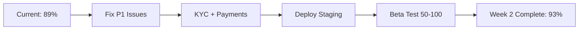
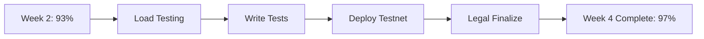
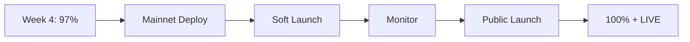

# TakeYourToken.app - Next Steps & Implementation Roadmap

> **Обновлено:** 14 января 2026
> **Версия:** 3.0 (Структурированный План)
> **Статус:** Active Development
> **Фокус:** takeyourtoken.app (БЕЗ путаницы с tyt.foundation)

---

## 📊 ТЕКУЩИЙ СТАТУС

```yaml
Общая Готовность:   89%
Sprint:             3 из 4 (Production Readiness)
Критические Блокеры: 5
Следующий Milestone: Staging Deployment (СЕГОДНЯ возможен)
Target Launch:      10 февраля 2026 (4 недели)
```

### Что Завершено ✅

- Все 54 страницы (public + app)
- 98 компонентов
- 184 миграции базы данных
- 35 Edge Functions
- 9 Smart Contracts (готовы к аудиту)
- Полная документация
- Security hardening (87/100)
- RLS policies (96/100)

### Что Осталось ⚠️

- Smart Contract Audit (BLOCKER)
- KYC Integration (HIGH)
- Payment On-Ramp (HIGH)
- Legal Documents (MEDIUM)
- Load Testing (MEDIUM)
- Test Coverage (LOW)

---

## 🎯 КРИТИЧЕСКИЙ ПУТЬ К ЗАПУСКУ

### Фаза 1: Security & Integrations (Неделя 1-2)



### Фаза 2: Testing & Optimization (Неделя 3-4)



### Фаза 3: Launch (Неделя 5+)



---

## 📋 ДЕТАЛЬНЫЙ ПЛАН ПО НЕДЕЛЯМ

## НЕДЕЛЯ 1 (14-20 января 2026)

### Понедельник-Вторник: Security Fixes 🔴

#### Task 1.1: Edge Functions JWT Auth (6 часов)

**Проблема:** Не все Edge Functions проверяют JWT токен

**Решение:**
1. Создать `requireAuth()` middleware в `_shared/auth.ts`
2. Применить ко всем public functions
3. Добавить per-user rate limiting

**Файлы для изменения:**
```typescript
// supabase/functions/_shared/auth.ts
export async function requireAuth(req: Request) {
  const authHeader = req.headers.get('Authorization');
  if (!authHeader) throw new Error('Missing Authorization');

  const token = authHeader.replace('Bearer ', '');
  const supabase = createClient(
    Deno.env.get('SUPABASE_URL')!,
    Deno.env.get('SUPABASE_SERVICE_ROLE_KEY')!
  );

  const { data: { user }, error } = await supabase.auth.getUser(token);
  if (error || !user) throw new Error('Invalid token');

  return { user, supabase };
}

// Применить к функциям:
// - aoi-chat
// - fetch-tyt-price
// - get-bitcoin-price
// - get-swap-rate
// - check-balance
```

**Priority:** P0 (CRITICAL)
**Owner:** Backend Team
**Validation:** Тест без токена должен вернуть 401

---

#### Task 1.2: CSP Headers (2 часа)

**Проблема:** Content-Security-Policy не настроен

**Решение:**
```typescript
// vite.config.js
export default defineConfig({
  plugins: [
    react(),
    {
      name: 'security-headers',
      configureServer(server) {
        server.middlewares.use((req, res, next) => {
          res.setHeader('Content-Security-Policy',
            "default-src 'self'; " +
            "script-src 'self' 'unsafe-inline' 'unsafe-eval'; " +
            "style-src 'self' 'unsafe-inline'; " +
            "img-src 'self' data: https:; " +
            "connect-src 'self' https://*.supabase.co https://api.openai.com"
          );
          next();
        });
      }
    }
  ]
});
```

**Priority:** P2
**Owner:** Frontend Team
**Validation:** Проверить headers в dev tools

---

### Среда-Четверг: KYC Integration ⚠️

#### Task 1.3: Выбор KYC Provider (2 часа)

**Опции:**

**Sumsub** (Рекомендуется)
- Цена: $500-1500/месяц
- Покрытие: 220+ стран
- API: Excellent
- Интеграция: 1 неделя

**Onfido**
- Цена: $1000-2000/месяц
- Покрытие: 195 стран
- API: Good
- Интеграция: 1 неделя

**Решение:** Выбрать Sumsub (лучше цена/качество)

---

#### Task 1.4: Sumsub API Integration (12 часов)

**Шаги:**

1. **Создать аккаунт Sumsub**
   - Зарегистрироваться на sumsub.com
   - Получить API keys (App Token + Secret Key)
   - Настроить verification flow в dashboard

2. **Backend Integration**

```typescript
// supabase/functions/kyc-initiate/index.ts
import { createClient } from 'npm:@supabase/supabase-js@2';

const SUMSUB_API_URL = 'https://api.sumsub.com';
const SUMSUB_APP_TOKEN = Deno.env.get('SUMSUB_APP_TOKEN')!;
const SUMSUB_SECRET_KEY = Deno.env.get('SUMSUB_SECRET_KEY')!;

Deno.serve(async (req: Request) => {
  const auth = await requireAuth(req);

  // Create applicant in Sumsub
  const response = await fetch(`${SUMSUB_API_URL}/resources/applicants`, {
    method: 'POST',
    headers: {
      'X-App-Token': SUMSUB_APP_TOKEN,
      'Content-Type': 'application/json'
    },
    body: JSON.stringify({
      externalUserId: auth.user.id,
      email: auth.user.email
    })
  });

  const data = await response.json();

  // Save to database
  await auth.supabase
    .from('user_settings')
    .update({
      kyc_provider: 'sumsub',
      kyc_provider_id: data.id,
      kyc_status: 'pending'
    })
    .eq('user_id', auth.user.id);

  return new Response(JSON.stringify({
    applicantId: data.id,
    verificationUrl: data.url
  }));
});
```

3. **Frontend Integration**

```typescript
// src/pages/app/KYC.tsx
export default function KYC() {
  const [loading, setLoading] = useState(false);

  const startVerification = async () => {
    setLoading(true);
    const { data } = await supabase.functions.invoke('kyc-initiate');

    // Redirect to Sumsub verification
    window.open(data.verificationUrl, '_blank');
    setLoading(false);
  };

  return (
    <div>
      <h1>KYC Verification</h1>
      <button onClick={startVerification} disabled={loading}>
        {loading ? 'Loading...' : 'Start Verification'}
      </button>
    </div>
  );
}
```

4. **Webhook для статусов**

```typescript
// supabase/functions/kyc-webhook/index.ts
Deno.serve(async (req: Request) => {
  const payload = await req.json();

  // Verify signature
  const signature = req.headers.get('X-Payload-Digest');
  // ... verify signature logic ...

  // Update status in database
  await supabase
    .from('user_settings')
    .update({
      kyc_status: payload.reviewResult.reviewAnswer, // 'GREEN' | 'RED'
      kyc_updated_at: new Date().toISOString()
    })
    .eq('kyc_provider_id', payload.applicantId);

  return new Response('OK');
});
```

5. **Database Migration**

```sql
-- supabase/migrations/YYYYMMDDHHMMSS_add_kyc_fields.sql
ALTER TABLE user_settings
ADD COLUMN IF NOT EXISTS kyc_provider TEXT,
ADD COLUMN IF NOT EXISTS kyc_provider_id TEXT,
ADD COLUMN IF NOT EXISTS kyc_status TEXT DEFAULT 'not_started',
ADD COLUMN IF NOT EXISTS kyc_submitted_at TIMESTAMPTZ,
ADD COLUMN IF NOT EXISTS kyc_updated_at TIMESTAMPTZ;

CREATE INDEX IF NOT EXISTS idx_user_settings_kyc_status
ON user_settings(kyc_status);
```

**Priority:** P1 (HIGH)
**Owner:** Full-stack Team
**Validation:** Пройти KYC flow end-to-end в sandbox

---

### Пятница: Payment On-Ramp ⚠️

#### Task 1.5: Payment Provider Integration (12 часов)

**Опции:**

**Stripe** (Рекомендуется для карт)
- Fees: 2.9% + $0.30
- Currencies: 135+
- Crypto: Via partners

**Ramp Network** (Рекомендуется для крипты)
- Fees: 1.5-2.9%
- Direct crypto purchases
- Compliance included

**Решение:** Использовать оба:
- Stripe для fiat → TYT
- Ramp для crypto → TYT

**Stripe Integration:**

1. **Backend**

```typescript
// supabase/functions/payment-create-intent/index.ts
import Stripe from 'npm:stripe@14';

const stripe = new Stripe(Deno.env.get('STRIPE_SECRET_KEY')!, {
  apiVersion: '2023-10-16'
});

Deno.serve(async (req: Request) => {
  const auth = await requireAuth(req);
  const { amount, currency } = await req.json();

  const paymentIntent = await stripe.paymentIntents.create({
    amount: amount * 100, // cents
    currency,
    metadata: {
      user_id: auth.user.id,
      type: 'tyt_purchase'
    }
  });

  return new Response(JSON.stringify({
    clientSecret: paymentIntent.client_secret
  }));
});
```

2. **Frontend**

```typescript
// src/components/PaymentModal.tsx
import { loadStripe } from '@stripe/stripe-js';
import { Elements, PaymentElement } from '@stripe/react-stripe-js';

const stripePromise = loadStripe(import.meta.env.VITE_STRIPE_PUBLIC_KEY);

export default function PaymentModal({ amount }: { amount: number }) {
  const [clientSecret, setClientSecret] = useState('');

  useEffect(() => {
    fetch('/functions/v1/payment-create-intent', {
      method: 'POST',
      body: JSON.stringify({ amount, currency: 'usd' })
    })
    .then(res => res.json())
    .then(data => setClientSecret(data.clientSecret));
  }, [amount]);

  return clientSecret ? (
    <Elements stripe={stripePromise} options={{ clientSecret }}>
      <PaymentForm />
    </Elements>
  ) : <div>Loading...</div>;
}
```

3. **Webhook для confirmation**

```typescript
// supabase/functions/payment-webhook/index.ts
Deno.serve(async (req: Request) => {
  const signature = req.headers.get('stripe-signature')!;
  const body = await req.text();

  const event = stripe.webhooks.constructEvent(
    body,
    signature,
    Deno.env.get('STRIPE_WEBHOOK_SECRET')!
  );

  if (event.type === 'payment_intent.succeeded') {
    const intent = event.data.object;
    const userId = intent.metadata.user_id;

    // Mint TYT to user's wallet
    await mintTYT(userId, intent.amount / 100);

    // Record transaction
    await supabase.from('wallet_transactions').insert({
      user_id: userId,
      type: 'purchase',
      currency: 'TYT',
      amount: intent.amount / 100,
      status: 'completed'
    });
  }

  return new Response('OK');
});
```

**Priority:** P1 (HIGH)
**Owner:** Full-stack Team
**Validation:** Купить $10 TYT с test card

---

### Выходные: Staging Deployment 🚀

#### Task 1.6: Deploy to Staging (4 часа)

**Шаги:**

1. **Environment Setup**
```bash
# .env.staging
VITE_ENV=staging
VITE_SUPABASE_URL=https://xyoaobelwkmrncvktrkv.supabase.co
VITE_SUPABASE_ANON_KEY=<staging_key>
VITE_STRIPE_PUBLIC_KEY=<test_key>
VITE_SUMSUB_SDK_TOKEN=<test_key>
```

2. **Build & Deploy**
```bash
# Build
npm run build

# Deploy to Vercel
vercel --prod --env-file=.env.staging

# Or deploy to Netlify
netlify deploy --prod --dir=dist
```

3. **Supabase Configuration**
- Открыть Supabase Dashboard
- Settings → API → Site URL: `https://staging.takeyourtoken.app`
- Settings → API → Redirect URLs: добавить staging URLs

4. **Smoke Tests**
```bash
# Test homepage
curl -I https://staging.takeyourtoken.app

# Test API health
curl https://staging.takeyourtoken.app/api/health

# Test auth (manual)
# 1. Signup
# 2. Login
# 3. Access dashboard
```

**Priority:** P0
**Owner:** DevOps + QA
**Validation:** Все критические flows работают

---

## НЕДЕЛЯ 2 (21-27 января 2026)

### Понедельник-Среда: Beta Testing

#### Task 2.1: Recruit Beta Testers (4 часа)

**Target:** 50-100 users

**Channels:**
- Discord/Telegram crypto communities
- Twitter crypto influencers
- Product Hunt "Ship" page
- Reddit (r/CryptoTechnology, r/ethereum)
- Friends & family

**Incentives:**
- Early access
- 100 TYT bonus
- Exclusive beta badge
- Lifetime 5% discount

**Sign-up Form:**
```typescript
// Google Forms or Typeform
- Email
- Twitter handle
- Experience level (Beginner/Intermediate/Advanced)
- What interests you? (Mining/Academy/Foundation/Trading)
- Referral code (optional)
```

---

#### Task 2.2: Beta Monitoring (Daily, 2 hours/day)

**Metrics to Track:**
- Signups per day
- Activation rate (signup → first action)
- DAU (daily active users)
- Feature usage
- Error rates
- Support tickets

**Tools:**
- Supabase Analytics
- Google Analytics (add if not present)
- Custom dashboard

**Daily Review:**
- Morning: Check overnight activity
- Noon: Review errors + fix critical bugs
- Evening: Summarize day + plan tomorrow

---

### Четверг-Пятница: Load Testing

#### Task 2.3: Set Up k6 Load Testing (6 часов)

**Install k6:**
```bash
# Mac
brew install k6

# Linux
sudo apt install k6
```

**Test Scripts:**

1. **Homepage Load Test**
```javascript
// tests/load/homepage.js
import http from 'k6/http';
import { check, sleep } from 'k6';

export const options = {
  stages: [
    { duration: '2m', target: 100 },
    { duration: '5m', target: 100 },
    { duration: '2m', target: 0 }
  ]
};

export default function() {
  const res = http.get('https://staging.takeyourtoken.app');
  check(res, {
    'status is 200': (r) => r.status === 200,
    'load time < 3s': (r) => r.timings.duration < 3000
  });
  sleep(1);
}
```

2. **API Load Test**
```javascript
// tests/load/api.js
export const options = {
  stages: [
    { duration: '1m', target: 50 },
    { duration: '3m', target: 200 },
    { duration: '1m', target: 0 }
  ]
};

export default function() {
  const token = __ENV.TEST_TOKEN;

  const res = http.post(
    'https://xyoaobelwkmrncvktrkv.supabase.co/functions/v1/aoi-chat',
    JSON.stringify({ question: 'What is Bitcoin?' }),
    {
      headers: {
        'Authorization': `Bearer ${token}`,
        'Content-Type': 'application/json'
      }
    }
  );

  check(res, {
    'status is 200': (r) => r.status === 200,
    'response time < 500ms': (r) => r.timings.duration < 500
  });

  sleep(2);
}
```

**Run Tests:**
```bash
# Homepage
k6 run tests/load/homepage.js

# API
TEST_TOKEN=<token> k6 run tests/load/api.js
```

**Success Criteria:**
- 100 concurrent users: no errors
- 500 concurrent users: <1% error rate
- Response time p95 < 500ms
- No database timeouts

**If Failed:**
- Optimize slow queries
- Add database indexes
- Enable connection pooling
- Scale infrastructure

**Priority:** P2
**Owner:** Backend + DevOps
**Validation:** Pass all load tests

---

## НЕДЕЛЯ 3-4 (28 января - 10 февраля 2026)

### Testing & Final Polish

#### Task 3.1: Write Critical Tests (20 часов)

**Unit Tests (Vitest):**

```bash
# Install
npm install --save-dev vitest @testing-library/react
```

```typescript
// src/utils/__tests__/rewardsService.test.ts
import { describe, it, expect } from 'vitest';
import { calculateNetReward, applyDiscount } from '../rewardsService';

describe('Rewards Calculations', () => {
  it('calculates net reward correctly', () => {
    const gross = 100;
    const electricity = 20;
    const fee = 5;

    const net = calculateNetReward(gross, electricity, fee);
    expect(net).toBe(75);
  });

  it('applies VIP discount correctly', () => {
    const base = 100;
    const discount = 20; // 20%

    const result = applyDiscount(base, discount);
    expect(result).toBe(80);
  });
});
```

**Priority Tests:**
1. Reward calculations (rewardsService)
2. Discount calculations (discountService)
3. Maintenance invoices (maintenanceService)
4. Merkle tree (merkleTree)
5. Wallet balances (walletService)

**E2E Tests (Playwright):**

```bash
# Install
npm install --save-dev @playwright/test
```

```typescript
// tests/e2e/critical-paths.spec.ts
import { test, expect } from '@playwright/test';

test('User can complete signup and access dashboard', async ({ page }) => {
  await page.goto('https://staging.takeyourtoken.app');

  // Click signup
  await page.click('text=Get Started');

  // Fill form
  await page.fill('[name=email]', `test${Date.now()}@example.com`);
  await page.fill('[name=password]', 'UniquePassword!2026@TYT');

  // Submit
  await page.click('button:has-text("Sign Up")');

  // Should redirect to dashboard
  await expect(page).toHaveURL(/\/app\/dashboard/);

  // Should see welcome message
  await expect(page.locator('text=Welcome')).toBeVisible();
});
```

**Target Coverage:**
- Unit: 70%+
- E2E: 5+ critical journeys

---

#### Task 3.2: Smart Contract Testnet Deployment (12 часов)

**Prerequisites:**
- Polygon Amoy testnet account
- Testnet MATIC from faucet
- Alchemy API key (testnet)

**Steps:**

1. **Setup Environment**
```bash
cd contracts/evm
cp .env.example .env.testnet

# Fill in:
PRIVATE_KEY=<deployer_private_key>
POLYGON_AMOY_RPC=https://polygon-amoy.g.alchemy.com/v2/<key>
POLYGONSCAN_API_KEY=<key>
```

2. **Get Testnet MATIC**
```
Visit: https://faucet.polygon.technology/
Request to deployer address
```

3. **Deploy Contracts**
```bash
forge script script/DeployV3Core.s.sol \
  --rpc-url $POLYGON_AMOY_RPC \
  --broadcast \
  --verify
```

4. **Save Addresses**
```json
// contracts/evm/deployments/polygon-amoy.json
{
  "MinerNFT": "0x...",
  "Marketplace": "0x...",
  "CharityVault": "0x...",
  ...
}
```

5. **Update Frontend**
```typescript
// src/lib/web3/config.ts
import deploymentAmoy from '../../../contracts/evm/deployments/polygon-amoy.json';

export const CONTRACTS = {
  [polygonAmoy.id]: {
    MINER_NFT: deploymentAmoy.MinerNFT,
    MARKETPLACE: deploymentAmoy.Marketplace,
    // ...
  }
};
```

**Priority:** P1
**Owner:** Blockchain Team
**Validation:** Mint test NFT on testnet

---

#### Task 3.3: Legal Documents (10 часов + $5-10k)

**Required Documents:**

1. **Terms of Service**
   - NFTs = service access (not securities)
   - No guaranteed returns
   - Dynamic rewards
   - User responsibilities
   - Dispute resolution

2. **Privacy Policy**
   - GDPR compliance
   - CCPA compliance
   - Data collection
   - Third-party services
   - Retention policies

3. **Foundation Charter**
   - Jurisdiction (recommend: Delaware non-profit)
   - Board structure
   - Grant allocation
   - Transparency requirements

**Process:**
1. Draft documents (use templates)
2. Legal review ($5-10k)
3. Revise based on feedback
4. Publish on website
5. User acceptance flow (checkbox on signup)

**Priority:** P2
**Owner:** Legal + Founder
**Validation:** Legal approval

---

## НЕДЕЛЯ 5+ (11 февраля 2026+)

### Mainnet Deployment & Launch

#### Task 4.1: Smart Contract Audit 🔴

**Status:** CRITICAL BLOCKER

**Recommended Auditors:**
1. **Certik** - $20-30k, 3-4 weeks
2. **OpenZeppelin** - $15-25k, 3-4 weeks
3. **Trail of Bits** - $25-40k, 4-5 weeks

**Process:**
1. Select auditor (Week 5)
2. Submit contracts + docs (Week 5)
3. Preliminary review (Week 6)
4. Fix findings (Week 7)
5. Final report (Week 8)

**CANNOT DEPLOY TO MAINNET WITHOUT AUDIT**

**Priority:** P0 (BLOCKING)
**Owner:** External Auditor
**Cost:** $15-30k
**Timeline:** 3-4 weeks

---

#### Task 4.2: Mainnet Deployment (Day 1)

**Prerequisites:**
- Audit complete ✅
- All findings fixed ✅
- Insurance acquired ✅
- Legal docs finalized ✅

**Steps:**

1. **Deploy All Contracts**
```bash
forge script script/DeployV3Core.s.sol \
  --rpc-url $POLYGON_MAINNET_RPC \
  --broadcast \
  --verify
```

2. **Verify on PolygonScan**
3. **Update Frontend**
4. **Fund Vaults**
   - AcademyVault: 100k TYT
   - CharityVault: 50k TYT
   - FeeConfigGovernance: 100k TYT

5. **Transfer Ownership to Multisig**
6. **Announce on Social Media**

---

#### Task 4.3: Public Launch (Day 1)

**Marketing Campaign:**
- Press release (Forbes, TechCrunch, CoinDesk)
- Twitter thread
- LinkedIn post
- Reddit AMAs
- Crypto influencer partnerships
- Paid ads (Google, Twitter, Facebook)

**Launch Incentives:**
- First 1000 users: 50 TYT bonus
- Referrals: 5% commission
- Early miners: 10% discount

**Monitoring:**
- 24/7 on-call rotation
- Error tracking (Sentry)
- Performance monitoring (Vercel)
- User feedback (Discord/Telegram)

---

## 🔄 РАЗДЕЛЕНИЕ: takeyourtoken.app vs tyt.foundation

### takeyourtoken.app (ЭТОТ ПРОЕКТ) ✅

**Все основные функции:**
- ✅ Authentication & profiles
- ✅ Wallet management (custodial + Web3)
- ✅ NFT miner minting & management
- ✅ NFT marketplace (buy/sell/trade)
- ✅ Daily mining rewards
- ✅ Maintenance payments
- ✅ Reinvestment engine
- ✅ Multi-chain deposits/withdrawals
- ✅ TYT token trading (swap, bridge)
- ✅ Governance (veTYT + proposals)
- ✅ Academy courses & quizzes
- ✅ Certificates (SBT on Solana)
- ✅ Referral program
- ✅ Gamification (quests, ranks, clans)
- ✅ Admin panel (users, messages, withdrawals)
- ⚠️ KYC verification (integration pending)
- ⚠️ Payment processing (integration pending)

**Foundation integration IN APP:**
- ✅ Donation widget (встроен)
- ✅ Foundation stats display (real-time)
- ✅ Charity staking (встроен)
- ✅ Grant applications (встроен)
- ✅ Impact reports view (встроен)
- ✅ aOi assistant (с foundation context)

### tyt.foundation (ОТДЕЛЬНЫЙ ПРОЕКТ) 🔄

**Только информация о фонде:**
- Foundation landing page
- Research & impact showcase
- CNS knowledge base (public access)
- Grant program details
- Partner hospitals list
- Donation acceptance (standalone, separate from app)
- Transparency reports
- Medical team profiles
- Success stories
- Media & press kit
- Contact forms

**НЕ дублируется:**
- Не показываем mining (это в app)
- Не показываем NFT (это в app)
- Не показываем trading (это в app)
- Не показываем governance (это в app)

### Shared Infrastructure

```yaml
✅ Общая база данных (Supabase):
  - profiles (user data)
  - foundation_stats
  - knowledge_base_cns
  - knowledge_base_web3
  - aoi_conversations
  - foundation_donations (tracking)

⚠️ Раздельно:
  - Frontend deployments (разные URLs)
  - Auth sessions (разные домены)
  - Static assets (разные CDN)
  - API keys (разные цели)
```

### Cross-Domain Communication

```yaml
User Flows:

1. App → Foundation:
   Пользователь кликает "Learn About Foundation"
   → Redirect to tyt.foundation/about
   → Pass auth token via URL
   → Foundation shows personalized content

2. Foundation → App:
   Посетитель кликает "Start Mining"
   → Redirect to takeyourtoken.app/signup
   → Pass referral code
   → App shows Foundation-branded onboarding

3. Donation from App:
   User donates via widget in app
   → Records in ledger
   → Foundation reads ledger
   → Both show updated stats

4. aOi Interaction:
   User asks CNS question in app
   → App calls foundation API (primary)
   → Foundation returns answer + sources
   → App displays answer
   → Fallback: Local OpenAI if foundation unavailable
```

---

## 📊 МЕТРИКИ УСПЕХА

### Technical Metrics

```yaml
✅ Must Have (Before Public Launch):
  - Uptime > 99.9%
  - Response time p95 < 500ms
  - Error rate < 0.1%
  - Security score > 90/100
  - Test coverage > 70%
  - Smart contracts audited
  - All P0/P1 bugs fixed

⚠️ Nice to Have:
  - Lighthouse score > 95
  - Bundle size < 500KB
  - Database queries < 50ms avg
```

### Business Metrics

```yaml
Month 1 Targets:
  🎯 1,000+ registered users
  🎯 200+ daily active users
  🎯 100+ NFT miners minted
  🎯 $100k+ TVL
  🎯 $5k+ foundation donations
  🎯 50+ academy completions

Month 3 Targets:
  🎯 10,000+ users
  🎯 1,000+ daily active
  🎯 1,000+ miners
  🎯 $1M+ TVL
  🎯 $50k+ foundation

Month 6 Targets:
  🎯 50,000+ users
  🎯 5,000+ daily active
  🎯 5,000+ miners
  🎯 $5M+ TVL
  🎯 $250k+ foundation
```

### User Satisfaction

```yaml
🎯 NPS > 50
🎯 Support ticket rate < 1%
🎯 Resolution time < 24h
🎯 User retention D30 > 60%
🎯 Feature adoption > 40%
```

---

## 🐛 ИЗВЕСТНЫЕ ПРОБЛЕМЫ & FIXES

### P0: Critical (0) ✅

None!

### P1: High (3) ⚠️

1. **Edge Functions Missing JWT**
   - Fix: Task 1.1 (Week 1)
   - ETA: 2 days

2. **Smart Contracts Not Audited**
   - Fix: Task 4.1 (Week 5-8)
   - ETA: 3-4 weeks + $15-30k

3. **Missing 2FA/MFA**
   - Fix: Post-launch (Sprint 5)
   - ETA: 1 week

### P2: Medium (8) 🟡

1. No KYC → Task 1.4 (Week 1)
2. No Payment → Task 1.5 (Week 1)
3. Mock Blockchain → Week 2
4. No Error Monitoring → Week 2
5. No Performance Monitoring → Week 2
6. Limited Test Coverage → Task 3.1 (Week 3)
7. CSP Headers → Task 1.2 (Week 1)
8. Admin Audit Log → Post-launch

---

## 💰 BUDGET ESTIMATE

### One-Time Costs

```yaml
Smart Contract Audit:  $15,000 - $30,000
Legal Review:          $5,000 - $10,000
Insurance (Down):      $10,000 - $20,000
Security Audit:        $3,000 - $5,000
Marketing (Launch):    $5,000 - $10,000
─────────────────────────────────────────
Total One-Time:        $38,000 - $75,000
```

### Monthly Operating Costs

```yaml
Infrastructure:
  - Vercel Pro:        $20
  - Supabase Pro:      $25
  - Cloudflare:        $0 (free)
  - Domain:            $1
  Subtotal:            $46

External Services:
  - OpenAI API:        $100 - $500
  - Alchemy RPC:       $0 - $199
  - KYC Provider:      $500 - $1,500
  - Payment Provider:  1.5% - 3% of volume
  - Email (SendGrid):  $20 - $50
  - Sentry:            $29 - $100
  - Analytics:         $0 (free tier)
  Subtotal:            $649 - $2,349

Total Monthly:         $695 - $2,395
```

### First 3 Months Total

```yaml
One-Time:              $38,000 - $75,000
Monthly (x3):          $2,085 - $7,185
─────────────────────────────────────────
Total:                 $40,085 - $82,185
```

---

## 📅 TIMELINE SUMMARY

```yaml
Week 1 (Jan 14-20):
  ✅ Fix P1 security issues
  ✅ Integrate KYC
  ✅ Integrate Payments
  ✅ Deploy to staging

Week 2 (Jan 21-27):
  ✅ Beta testing (50-100 users)
  ✅ Load testing
  ✅ Bug fixes
  ✅ Performance optimization

Week 3-4 (Jan 28 - Feb 10):
  ✅ Write critical tests
  ✅ Deploy to testnet
  ✅ Finalize legal docs
  ✅ Address beta feedback

Week 5-8 (Feb 11 - Mar 10):
  ⚠️ Smart contract audit (BLOCKER)
  ✅ Final polish
  ✅ Insurance acquisition

Week 9 (Mar 11-17):
  🚀 Mainnet deployment
  🚀 Soft launch (limited access)

Week 10+ (Mar 18+):
  🎉 Public launch
  📈 Marketing campaign
  📊 Scale infrastructure
```

---

## 🎯 ПРИОРИТЕТЫ

### Сегодня (14 января)

1. Прочитать этот документ полностью
2. Прочитать PROJECT_STATUS_REPORT.md
3. Определить team capacity
4. Начать Task 1.1 (Edge Functions JWT)
5. Связаться с foundation team (API sync)

### На Этой Неделе

1. Завершить все Week 1 tasks
2. Deploy на staging
3. Пригласить beta testers
4. Начать контакт с аудиторами (contracts)

### В Следующем Месяце

1. Завершить beta testing
2. Интегрировать все внешние сервисы
3. Написать критические tests
4. Deploy contracts на testnet
5. Запустить audit процесс

---

## 📞 КОНТАКТЫ & РЕСУРСЫ

### Documentation
- PROJECT_STATUS_REPORT.md - полный технический аудит
- COMPREHENSIVE_DEPLOYMENT_GUIDE.md - deployment инструкции
- DEPLOYMENT_CHECKLIST.md - pre/post deploy checklist
- docs/ - вся остальная документация

### External Services
- Supabase: https://supabase.com/dashboard
- Alchemy: https://dashboard.alchemy.com
- Sumsub: https://sumsub.com
- Stripe: https://dashboard.stripe.com

### Support
- Supabase Support: https://supabase.com/dashboard/support
- Project Issues: GitHub Issues (if configured)

---

## ✅ ФИНАЛЬНАЯ ПРОВЕРКА

Перед началом убедитесь:

- [ ] Прочитан PROJECT_STATUS_REPORT.md
- [ ] Прочитан этот документ (NEXT_STEPS.md)
- [ ] Team capacity определен
- [ ] Бюджет утвержден
- [ ] Foundation team на связи
- [ ] Auditor контакты готовы
- [ ] Понимание разделения app vs foundation

---

**Статус:** 🟢 READY TO EXECUTE
**Confidence:** HIGH (89%)
**Next Review:** 21 января 2026 (еженедельно)

**Успехов с запуском TakeYourToken.app!** 🚀
