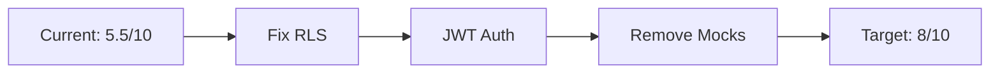

# TakeYourToken.app - Next Steps & Implementation Plan

> **Created**: 2026-01-12
> **Last Updated**: 2026-01-12
> **Status**: Active Development - Sprint 3
> **Target Launch**: February 22, 2026 (6 weeks)

---

## Table of Contents

1. [Overview](#overview)
2. [Critical Path to Production](#critical-path-to-production)
3. [Week-by-Week Breakdown](#week-by-week-breakdown)
4. [Foundation Integration](#foundation-integration)
5. [Security Hardening](#security-hardening)
6. [Blockchain Integration](#blockchain-integration)
7. [Content & Knowledge Base](#content--knowledge-base)
8. [Testing & QA](#testing--qa)
9. [Deployment Strategy](#deployment-strategy)
10. [Post-Launch](#post-launch)

---

## Overview

### Current Status
- **Completion**: 84%
- **Sprint**: 3 of 4 (Production Readiness)
- **Blockers**: 5 critical issues
- **Timeline**: 6-8 weeks to mainnet launch

### Goals
1. ✅ Achieve production-ready security (8/10 score)
2. ✅ Integrate with tyt.foundation (full cross-domain)
3. ✅ Deploy smart contracts to testnet → mainnet
4. ✅ Enable real blockchain transactions
5. ✅ Launch public beta

---

## Critical Path to Production

### Phase 1: Security Hardening (Week 1-2) 🔥 CRITICAL
**Target:** Fix all critical vulnerabilities
**Priority:** HIGHEST



### Phase 2: Foundation Integration (Week 1-2) 🔥 CRITICAL
**Target:** Full cross-domain communication
**Dependency:** tyt.foundation team

### Phase 3: Blockchain Integration (Week 2-4) ⚠️ HIGH
**Target:** Real transactions, contract deployment
**Dependency:** RPC providers, contract audits

### Phase 4: Testing & Beta (Week 5-6) ⚠️ HIGH
**Target:** Public beta with 50-100 testers
**Dependency:** Phases 1-3 complete

### Phase 5: Mainnet Launch (Week 7-8) ✅ GOAL
**Target:** Public launch with full features
**Dependency:** Successful beta

---

## Week-by-Week Breakdown

### Week 1 (Jan 13-19, 2026): Security & Foundation

#### Monday-Tuesday: RLS Security Fixes 🔥
**Objective:** Fix all `USING (true)` policies

- [ ] **Task 1.1**: Audit all 168 migrations for RLS policies
  - Search for: `USING (true)`, `WITH CHECK (true)`
  - Identify: 40+ affected policies
  - Document: Table name, current policy, required fix
  - **Time**: 4 hours
  - **Owner**: Backend team

- [ ] **Task 1.2**: Create consolidated RLS fix migration
  ```sql
  -- Template for fixes
  DROP POLICY IF EXISTS "old_policy_name" ON table_name;

  CREATE POLICY "Users can read own data"
    ON table_name FOR SELECT
    TO authenticated
    USING (auth.uid() = user_id);

  CREATE POLICY "Admins can read all"
    ON table_name FOR SELECT
    TO authenticated
    USING (
      EXISTS (
        SELECT 1 FROM profiles
        WHERE id = auth.uid() AND is_admin = true
      )
    );
  ```
  - **Time**: 8 hours
  - **Owner**: Backend team

- [ ] **Task 1.3**: Test RLS policies
  - Create test users (regular + admin)
  - Verify isolation (user A can't see user B data)
  - Verify admin access
  - **Time**: 4 hours
  - **Owner**: QA team

#### Wednesday: Edge Function Auth 🔥
**Objective:** Add JWT verification to all public functions

- [ ] **Task 1.4**: Create shared auth middleware
  ```typescript
  // /supabase/functions/_shared/auth.ts
  export async function verifyAuth(req: Request) {
    const authHeader = req.headers.get('Authorization');
    if (!authHeader) throw new Error('Missing Authorization header');

    const token = authHeader.replace('Bearer ', '');
    const { data: { user }, error } = await supabaseAdmin.auth.getUser(token);

    if (error || !user) throw new Error('Invalid token');
    return user;
  }
  ```
  - **Time**: 2 hours
  - **Owner**: Backend team

- [ ] **Task 1.5**: Update all Edge Functions
  - Functions to update:
    - ✅ aoi-chat
    - ✅ fetch-tyt-price
    - ✅ get-bitcoin-price
    - ✅ get-swap-rate
    - ✅ check-balance
  - Add rate limiting per user (not just IP)
  - **Time**: 4 hours
  - **Owner**: Backend team

- [ ] **Task 1.6**: Test authenticated endpoints
  - Test without token (should fail)
  - Test with invalid token (should fail)
  - Test with valid token (should succeed)
  - **Time**: 2 hours
  - **Owner**: QA team

#### Thursday: Mock Removal 🔥
**Objective:** Remove or flag all mock data

- [ ] **Task 1.7**: Audit mock usage
  - Search codebase for: `mock`, `fake`, `dummy`, `randomUUID`
  - Files to check:
    - `/supabase/functions/process-withdrawal/index.ts` (mock tx_hash)
    - `/src/utils/realBlockchain.ts` (mock transactions)
    - `/src/pages/app/DataCenter.tsx` (mock stats)
  - **Time**: 2 hours
  - **Owner**: Full team

- [ ] **Task 1.8**: Implement feature flags
  ```typescript
  // /src/lib/featureFlags.ts
  export const FEATURE_FLAGS = {
    USE_REAL_BLOCKCHAIN: import.meta.env.VITE_ENV === 'production',
    USE_REAL_WITHDRAWALS: import.meta.env.VITE_ENV === 'production',
    ENABLE_MOCK_MINING: import.meta.env.VITE_ENV === 'development'
  };
  ```
  - **Time**: 4 hours
  - **Owner**: Backend team

- [ ] **Task 1.9**: Update withdrawal function
  - Production: Generate real tx (wait for blockchain integration)
  - Development: Use mock with clear warning
  - **Time**: 2 hours
  - **Owner**: Backend team

#### Friday: Foundation API Coordination 🔥
**Objective:** Ensure Foundation API is ready

- [ ] **Task 1.10**: Meet with Foundation team
  - Required endpoints:
    - `POST /api/aoi` - Chat interface
    - `GET /api/status` - Health check
    - `GET /api/foundation-stats` - Statistics
    - `GET /api/knowledge-search` - Vector search
  - CORS requirements:
    - Allow: `https://takeyourtoken.app`, `http://localhost:5173`
    - Headers: `Authorization`, `Content-Type`
  - **Time**: 2 hours (meeting)
  - **Owner**: Team leads

- [ ] **Task 1.11**: Test Foundation API
  - Deploy test endpoints on Foundation
  - Test from takeyourtoken.app
  - Verify CORS, auth, response format
  - **Time**: 4 hours
  - **Owner**: Full stack

- [ ] **Task 1.12**: Update aOi fallback logic
  ```typescript
  // Improved fallback chain
  try {
    // 1. Try Foundation API
    const response = await fetch('https://tyt.foundation/api/aoi', {...});
    if (response.ok) return { source: 'foundation', ...data };
  } catch {
    // 2. Try local Edge Function with OpenAI
    try {
      const response = await supabase.functions.invoke('aoi-chat', {...});
      if (response.data) return { source: 'local-ai', ...data };
    } catch {
      // 3. Pattern matching fallback
      return { source: 'local-pattern', ...patternMatch };
    }
  }
  ```
  - **Time**: 2 hours
  - **Owner**: Frontend team

#### Weekend: Security Testing
- [ ] **Task 1.13**: Run automated security scans
  - OWASP ZAP
  - Supabase security advisor
  - SQL injection tests
  - **Time**: 4 hours
  - **Owner**: Security lead

---

### Week 2 (Jan 20-26, 2026): Blockchain Prep & Content

#### Monday-Tuesday: Smart Contract Preparation ⚠️

- [ ] **Task 2.1**: Set up testnet infrastructure
  - Create deployer wallet (Polygon Amoy testnet)
  - Get testnet MATIC from faucet
  - Set up Alchemy account (free tier)
  - Configure Hardhat/Foundry for testnet
  - **Time**: 4 hours
  - **Owner**: Blockchain team

- [ ] **Task 2.2**: Deploy to testnet
  ```bash
  # contracts/evm/
  forge script script/DeployV3Core.s.sol \
    --rpc-url $POLYGON_AMOY_RPC \
    --broadcast \
    --verify
  ```
  - Contracts to deploy:
    1. MockTYT token (for testing)
    2. MinerNFT
    3. FeeConfig
    4. DiscountCurve
    5. Marketplace
    6. CharityVault
    7. VotingEscrowTYT
    8. RewardsMerkleRegistry
  - **Time**: 8 hours
  - **Owner**: Blockchain team

- [ ] **Task 2.3**: Verify contracts on PolygonScan
  - Run verification script
  - Check all contracts verified
  - Update frontend with contract addresses
  - **Time**: 2 hours
  - **Owner**: Blockchain team

#### Wednesday: Frontend Contract Integration ⚠️

- [ ] **Task 2.4**: Update contract addresses
  ```typescript
  // src/lib/web3/config.ts
  export const CONTRACTS = {
    [polygon.id]: {
      MINER_NFT: '0x...',
      MARKETPLACE: '0x...',
      CHARITY_VAULT: '0x...',
      // ... all addresses
    }
  };
  ```
  - **Time**: 1 hour
  - **Owner**: Frontend team

- [ ] **Task 2.5**: Test contract interactions
  - Mint NFT on testnet
  - List NFT on marketplace
  - Buy NFT
  - Verify events logged
  - **Time**: 4 hours
  - **Owner**: Full stack team

#### Thursday: RPC Provider Integration ⚠️

- [ ] **Task 2.6**: Set up Alchemy/Infura
  - Create accounts
  - Get API keys for all networks:
    - Ethereum Mainnet + Sepolia
    - Polygon Mainnet + Amoy
    - Arbitrum, Optimism, Base
  - Configure rate limits
  - **Time**: 2 hours
  - **Owner**: Backend team

- [ ] **Task 2.7**: Implement real deposit monitoring
  ```typescript
  // /supabase/functions/monitor-deposits/index.ts
  // Replace mock with real blockchain queries
  const provider = new AlchemyProvider('polygon', ALCHEMY_KEY);
  const block = await provider.getBlock('latest');
  const txs = await block.getTransactions();
  // Filter for deposits to our addresses
  ```
  - **Time**: 6 hours
  - **Owner**: Blockchain team

#### Friday: Content & Knowledge Base 📚

- [ ] **Task 2.8**: Expand aOi knowledge base
  - Add 20+ Academy articles
    - Topics: Web3 basics, mining, tokenomics, safety
  - Add 10+ CNS research articles (from Foundation)
  - Generate embeddings for all
  - **Time**: 8 hours
  - **Owner**: Content team

- [ ] **Task 2.9**: Academy lessons review
  - Review existing 16 lessons
  - Add lesson 17-20 (governance, advanced topics)
  - Update Russian translations
  - **Time**: 6 hours
  - **Owner**: Content + Translation team

---

### Week 3 (Jan 27 - Feb 2, 2026): Integration Testing

#### Monday-Tuesday: Cross-Domain Testing 🔗

- [ ] **Task 3.1**: Test takeyourtoken.app → tyt.foundation navigation
  - User clicks "Learn More" → goes to Foundation
  - Auth token passed correctly
  - Foundation recognizes user
  - **Time**: 4 hours
  - **Owner**: Full stack team

- [ ] **Task 3.2**: Test Foundation → App navigation
  - Foundation user clicks "Start Mining"
  - Redirects to takeyourtoken.app
  - Preserves session
  - Shows user dashboard
  - **Time**: 4 hours
  - **Owner**: Full stack team

- [ ] **Task 3.3**: Test aOi cross-domain sync
  - User asks aOi question on App
  - Foundation API responds
  - aOi progress syncs both domains
  - XP updates reflected everywhere
  - **Time**: 4 hours
  - **Owner**: Full stack + Foundation team

#### Wednesday: Real Transaction Testing ⚠️

- [ ] **Task 3.4**: Test real deposits (testnet)
  - User deposits testnet ETH
  - System detects transaction
  - Balance updates in database
  - User sees balance in wallet
  - **Time**: 4 hours
  - **Owner**: Full stack team

- [ ] **Task 3.5**: Test real withdrawals (testnet)
  - User requests withdrawal
  - System creates real transaction
  - Transaction confirmed on-chain
  - Balance deducted
  - **Time**: 4 hours
  - **Owner**: Full stack team

#### Thursday-Friday: Feature Completion

- [ ] **Task 3.6**: Implement missing features
  - [ ] Real-time price feeds (CoinGecko API)
  - [ ] Swap aggregator integration (Jupiter API)
  - [ ] Email notifications (SendGrid)
  - [ ] Analytics tracking (Mixpanel)
  - **Time**: 12 hours
  - **Owner**: Full stack team

---

### Week 4 (Feb 3-9, 2026): Security Audit & Beta Prep

#### Monday-Wednesday: Security Audit 🔒

- [ ] **Task 4.1**: Internal security review
  - Review all RLS policies
  - Test auth flows
  - Check for SQL injection
  - Test CORS, CSP headers
  - **Time**: 16 hours
  - **Owner**: Security team

- [ ] **Task 4.2**: External security audit (optional)
  - Engage external auditor
  - Focus on: Smart contracts, RLS, auth
  - **Cost**: $5,000 - $10,000
  - **Time**: 1 week (parallel)

#### Thursday-Friday: Beta Preparation

- [ ] **Task 4.3**: Beta environment setup
  - Deploy to staging (staging.takeyourtoken.app)
  - Use testnet contracts
  - Enable monitoring (Sentry, LogRocket)
  - **Time**: 4 hours
  - **Owner**: DevOps

- [ ] **Task 4.4**: Beta tester recruitment
  - Target: 50-100 testers
  - Channels: Discord, Twitter, crypto communities
  - Incentive: Early access, testnet tokens
  - **Time**: 4 hours
  - **Owner**: Marketing + Community

- [ ] **Task 4.5**: Beta documentation
  - Write beta guide
  - Known issues list
  - Feedback form
  - Bug bounty program
  - **Time**: 4 hours
  - **Owner**: Product team

---

### Week 5-6 (Feb 10-23, 2026): Public Beta

#### Week 5: Beta Launch & Monitoring

- [ ] **Task 5.1**: Launch public beta (Feb 10)
  - Announce on all channels
  - Send invites to testers
  - Monitor closely (24/7)
  - **Time**: Ongoing
  - **Owner**: Full team

- [ ] **Task 5.2**: Daily beta reviews
  - Review feedback daily
  - Triage bugs (critical/high/medium/low)
  - Fix critical bugs within 24h
  - **Time**: 2 hours/day
  - **Owner**: Full team

- [ ] **Task 5.3**: Performance optimization
  - Monitor load times
  - Optimize slow queries
  - Cache frequently accessed data
  - **Time**: 8 hours
  - **Owner**: Backend team

#### Week 6: Beta Iteration

- [ ] **Task 5.4**: Fix reported issues
  - Address all critical bugs
  - Fix high-priority bugs
  - Document medium/low for post-launch
  - **Time**: 20 hours
  - **Owner**: Full team

- [ ] **Task 5.5**: User experience improvements
  - Implement UX feedback
  - Improve onboarding flow
  - Add tooltips/hints
  - **Time**: 12 hours
  - **Owner**: Frontend team

- [ ] **Task 5.6**: Prepare for mainnet
  - Final smart contract audit
  - Prepare deployment scripts
  - Set up mainnet RPC endpoints
  - **Time**: 8 hours
  - **Owner**: Blockchain team

---

### Week 7 (Feb 24 - Mar 2, 2026): Mainnet Deployment

#### Monday: Mainnet Contract Deployment 🚀

- [ ] **Task 6.1**: Deploy to mainnet
  - Deploy all contracts to Polygon mainnet
  - Verify on PolygonScan
  - Update frontend with mainnet addresses
  - **Time**: 4 hours
  - **Owner**: Blockchain team
  - **Critical**: Have rollback plan ready

- [ ] **Task 6.2**: Smoke tests on mainnet
  - Test with small amounts of real crypto
  - Mint NFT ($1 worth)
  - List on marketplace
  - Test withdrawal (small amount)
  - **Time**: 2 hours
  - **Owner**: QA team

#### Tuesday-Wednesday: Production Deployment

- [ ] **Task 6.3**: Deploy to production
  - Deploy frontend to Vercel/Netlify
  - Update environment variables (mainnet)
  - Configure CDN (Cloudflare)
  - Enable monitoring
  - **Time**: 4 hours
  - **Owner**: DevOps

- [ ] **Task 6.4**: Production smoke tests
  - Test all critical paths
  - Register new user
  - Connect wallet
  - Mint NFT
  - Make donation to Foundation
  - **Time**: 4 hours
  - **Owner**: QA team

#### Thursday: Public Launch 🎉

- [ ] **Task 6.5**: Soft launch (Feb 27)
  - Announce to beta testers first
  - Monitor for issues
  - Gradual rollout
  - **Time**: All day
  - **Owner**: Full team

- [ ] **Task 6.6**: Marketing campaign
  - Press release
  - Social media announcement
  - Crypto news sites (CoinDesk, Decrypt, etc.)
  - Reddit, Discord, Twitter
  - **Time**: Ongoing
  - **Owner**: Marketing team

#### Friday: Monitoring & Support

- [ ] **Task 6.7**: 24/7 monitoring
  - Watch error rates
  - Monitor transaction volume
  - Check server load
  - Respond to support tickets
  - **Time**: Ongoing
  - **Owner**: On-call rotation

---

## Foundation Integration (Detailed)

### Required Foundation API Endpoints

#### 1. aOi Chat Interface
```typescript
POST https://tyt.foundation/api/aoi
Content-Type: application/json
Authorization: Bearer <token>

Request:
{
  "question": "What is medulloblastoma?",
  "context": {
    "domain": "app",
    "userLevel": "beginner",
    "language": "en"
  }
}

Response:
{
  "answer": "Medulloblastoma is...",
  "sources": [
    {
      "title": "Understanding Medulloblastoma",
      "url": "https://tyt.foundation/knowledge/...",
      "relevance": 0.95
    }
  ],
  "xp_earned": 2
}
```

#### 2. Foundation Status
```typescript
GET https://tyt.foundation/api/status

Response:
{
  "status": "online",
  "version": "1.0.0",
  "services": {
    "aoi": "operational",
    "database": "operational",
    "knowledge_base": "operational"
  }
}
```

#### 3. Foundation Statistics
```typescript
GET https://tyt.foundation/api/foundation-stats

Response:
{
  "total_raised": "342150.50",
  "active_grants": 8,
  "families_supported": 47,
  "research_partners": 12,
  "last_updated": "2026-02-15T10:30:00Z"
}
```

#### 4. Knowledge Base Search
```typescript
POST https://tyt.foundation/api/knowledge-search
Content-Type: application/json

Request:
{
  "query": "brain tumor treatment",
  "category": "cns",
  "limit": 5
}

Response:
{
  "results": [
    {
      "title": "Modern Treatment Approaches",
      "excerpt": "...",
      "similarity": 0.89,
      "url": "/knowledge/treatment-approaches"
    }
  ]
}
```

### Cross-Domain Data Flow

```
┌─────────────────────────────────────────────────────────┐
│                  User Action (App)                      │
└─────────────┬───────────────────────────────────────────┘
              │
              ▼
┌─────────────────────────────────────────────────────────┐
│          Shared Supabase Database                       │
│  • User profiles (with aOi progress)                    │
│  • Academy progress (XP, level)                         │
│  • Foundation donations                                 │
│  • Knowledge base (vectors)                             │
└─────────────┬───────────────────────────────────────────┘
              │
              ▼
┌─────────────────────────────────────────────────────────┐
│         Foundation Reads Data                           │
│  • Display user progress                                │
│  • Show donation history                                │
│  • Provide personalized content                         │
└─────────────────────────────────────────────────────────┘
```

### Implementation Checklist

- [ ] **Foundation team**: Deploy API endpoints
- [ ] **Foundation team**: Enable CORS for takeyourtoken.app
- [ ] **Foundation team**: Set up auth token verification
- [ ] **App team**: Update aoiApiClient.ts with production URLs
- [ ] **App team**: Test cross-domain navigation
- [ ] **App team**: Test aOi chat with Foundation API
- [ ] **Both teams**: Test cross-domain authentication
- [ ] **Both teams**: Test data synchronization
- [ ] **Both teams**: Load testing for cross-domain traffic

---

## Security Hardening (Detailed)

### Priority 1: RLS Policies 🔥

#### Step 1: Identify Vulnerable Policies
```bash
# Search all migrations
cd supabase/migrations/
grep -r "USING (true)" . > vulnerable_rls.txt
grep -r "WITH CHECK (true)" . >> vulnerable_rls.txt

# Expected: 40+ matches
```

#### Step 2: Create Fix Migration Template
```sql
-- File: supabase/migrations/20260113000000_fix_all_rls_vulnerabilities.sql

/*
  # Fix All RLS Vulnerabilities

  1. Security Fixes
    - Remove all USING (true) policies
    - Add proper auth.uid() checks
    - Add admin-only policies where needed
    - Add public read for educational content only

  2. Affected Tables (40+)
    - contact_submissions
    - email_notifications
    - foundation_contact_info
    - [... full list from audit]
*/

-- BEFORE (VULNERABLE):
DROP POLICY IF EXISTS "Public can view foundation info" ON foundation_contact_info;

-- AFTER (SECURE):
-- Educational content: Public read, admin write
CREATE POLICY "Anyone can view foundation info"
  ON foundation_contact_info FOR SELECT
  TO anon, authenticated
  USING (is_public = true);

CREATE POLICY "Admins can manage foundation info"
  ON foundation_contact_info FOR ALL
  TO authenticated
  USING (
    EXISTS (
      SELECT 1 FROM profiles
      WHERE id = auth.uid() AND is_admin = true
    )
  );

-- User data: Owner only
CREATE POLICY "Users can view own contact submissions"
  ON contact_submissions FOR SELECT
  TO authenticated
  USING (
    user_id = auth.uid() OR
    EXISTS (
      SELECT 1 FROM profiles
      WHERE id = auth.uid() AND is_admin = true
    )
  );

-- Continue for all 40+ tables...
```

#### Step 3: Test RLS
```typescript
// Test script: scripts/test-rls.ts
import { createClient } from '@supabase/supabase-js';

// Test 1: User can only see own data
const user1Client = createClient(SUPABASE_URL, ANON_KEY);
await user1Client.auth.signInWithPassword({ email: 'user1@test.com', password: 'test' });

const { data, error } = await user1Client
  .from('profiles')
  .select('*');

console.assert(data.length === 1, 'User should only see own profile');
console.assert(data[0].email === 'user1@test.com', 'Should be own profile');

// Test 2: Admin can see all data
const adminClient = createClient(SUPABASE_URL, ANON_KEY);
await adminClient.auth.signInWithPassword({ email: 'admin@test.com', password: 'admin' });

const { data: allProfiles } = await adminClient
  .from('profiles')
  .select('*');

console.assert(allProfiles.length > 1, 'Admin should see all profiles');

// Test 3: Anon can see public content
const anonClient = createClient(SUPABASE_URL, ANON_KEY);

const { data: lessons } = await anonClient
  .from('academy_lessons')
  .select('*');

console.assert(lessons.length > 0, 'Anon should see public lessons');

console.log('✅ All RLS tests passed');
```

### Priority 2: Edge Function Auth 🔥

#### Step 1: Create Auth Middleware
```typescript
// File: supabase/functions/_shared/requireAuth.ts

import { createClient } from 'npm:@supabase/supabase-js@2';

export interface AuthContext {
  user: {
    id: string;
    email: string;
    is_admin: boolean;
  };
  supabase: SupabaseClient;
}

export async function requireAuth(req: Request): Promise<AuthContext> {
  const authHeader = req.headers.get('Authorization');

  if (!authHeader) {
    throw new Error('Missing Authorization header');
  }

  const token = authHeader.replace('Bearer ', '');

  const supabase = createClient(
    Deno.env.get('SUPABASE_URL')!,
    Deno.env.get('SUPABASE_SERVICE_ROLE_KEY')!
  );

  const { data: { user }, error } = await supabase.auth.getUser(token);

  if (error || !user) {
    throw new Error('Invalid or expired token');
  }

  // Get user profile for is_admin flag
  const { data: profile } = await supabase
    .from('profiles')
    .select('is_admin')
    .eq('id', user.id)
    .single();

  return {
    user: {
      id: user.id,
      email: user.email!,
      is_admin: profile?.is_admin || false
    },
    supabase
  };
}

export async function requireAdmin(req: Request): Promise<AuthContext> {
  const auth = await requireAuth(req);

  if (!auth.user.is_admin) {
    throw new Error('Admin access required');
  }

  return auth;
}
```

#### Step 2: Update Edge Functions
```typescript
// Example: supabase/functions/aoi-chat/index.ts

import { requireAuth } from '../_shared/requireAuth.ts';
import { rateLimiter } from '../_shared/rateLimiter.ts';
import { corsHeaders } from '../_shared/cors.ts';

Deno.serve(async (req: Request) => {
  // Handle CORS
  if (req.method === 'OPTIONS') {
    return new Response(null, { headers: corsHeaders });
  }

  try {
    // 1. Require authentication
    const auth = await requireAuth(req);

    // 2. Rate limit per user (not just IP)
    await rateLimiter.checkLimit(`user:${auth.user.id}`, {
      max: 20, // 20 requests
      window: 60 // per minute
    });

    // 3. Process request
    const { question, context } = await req.json();

    // ... rest of function

  } catch (error) {
    const status = error.message.includes('Authorization') ? 401 :
                   error.message.includes('rate limit') ? 429 : 500;

    return new Response(
      JSON.stringify({ error: error.message }),
      {
        status,
        headers: { ...corsHeaders, 'Content-Type': 'application/json' }
      }
    );
  }
});
```

### Priority 3: Remove Mocks 🔥

#### Feature Flag System
```typescript
// File: src/lib/featureFlags.ts

export const FEATURE_FLAGS = {
  // Blockchain
  USE_REAL_BLOCKCHAIN: import.meta.env.VITE_ENV === 'production',
  USE_REAL_DEPOSITS: import.meta.env.VITE_ENV === 'production',
  USE_REAL_WITHDRAWALS: import.meta.env.VITE_ENV === 'production',

  // Mining
  USE_REAL_HASHRATE: import.meta.env.VITE_ENV === 'production',
  ENABLE_MOCK_REWARDS: import.meta.env.VITE_ENV === 'development',

  // Payments
  USE_REAL_PAYMENTS: import.meta.env.VITE_ENV === 'production',

  // AI
  USE_FOUNDATION_AOI: true, // Always try Foundation first
  ENABLE_LOCAL_AOI_FALLBACK: true,

  // Debug
  ENABLE_DEBUG_LOGS: import.meta.env.VITE_ENV !== 'production',
  SHOW_MOCK_WARNINGS: import.meta.env.VITE_ENV === 'staging',
} as const;

export function assertProductionReady() {
  if (import.meta.env.VITE_ENV === 'production') {
    const mockFeatures = Object.entries(FEATURE_FLAGS)
      .filter(([key, value]) => key.includes('MOCK') && value === true);

    if (mockFeatures.length > 0) {
      throw new Error(
        `Cannot deploy to production with mock features enabled: ${mockFeatures.map(f => f[0]).join(', ')}`
      );
    }
  }
}
```

#### Update Mock Implementations
```typescript
// File: src/utils/realBlockchain.ts

import { FEATURE_FLAGS } from '../lib/featureFlags';

export async function createWithdrawal(amount: number, address: string, network: string) {
  if (!FEATURE_FLAGS.USE_REAL_WITHDRAWALS) {
    // Development/Staging: Use mock
    console.warn('🚧 Using MOCK withdrawal (development mode)');

    return {
      tx_hash: `MOCK-${crypto.randomUUID()}`,
      status: 'pending',
      network,
      amount,
      address,
      is_mock: true
    };
  }

  // Production: Real blockchain transaction
  const provider = getProvider(network);
  const wallet = getWallet(); // Secure wallet from env

  const tx = await wallet.sendTransaction({
    to: address,
    value: parseEther(amount.toString())
  });

  await tx.wait();

  return {
    tx_hash: tx.hash,
    status: 'confirmed',
    network,
    amount,
    address,
    is_mock: false
  };
}
```

---

## Blockchain Integration (Detailed)

### Phase 1: Testnet Deployment

#### Contract Deployment Checklist
```bash
# 1. Environment setup
cd contracts/evm/
cp .env.example .env.testnet

# 2. Fill in .env.testnet
PRIVATE_KEY=<deployer_private_key>
POLYGON_AMOY_RPC=https://polygon-amoy.g.alchemy.com/v2/<key>
POLYGONSCAN_API_KEY=<key>
DEPLOYER_ADDRESS=<address>

# 3. Get testnet tokens
# Visit: https://faucet.polygon.technology/
# Request MATIC to deployer address

# 4. Dry run
forge script script/DeployV3Core.s.sol \
  --rpc-url $POLYGON_AMOY_RPC \
  --sender $DEPLOYER_ADDRESS

# 5. Actual deployment
forge script script/DeployV3Core.s.sol \
  --rpc-url $POLYGON_AMOY_RPC \
  --broadcast \
  --verify \
  --sender $DEPLOYER_ADDRESS

# 6. Save deployment addresses
# Output will be in:
# contracts/evm/deployments/polygon-amoy.json
```

#### Deployment Output Format
```json
{
  "network": "polygon-amoy",
  "chainId": 80002,
  "deployedAt": "2026-01-20T10:30:00Z",
  "deployer": "0x...",
  "contracts": {
    "MockTYT": {
      "address": "0x...",
      "txHash": "0x...",
      "blockNumber": 12345,
      "verified": true
    },
    "MinerNFT": {
      "address": "0x...",
      "txHash": "0x...",
      "blockNumber": 12346,
      "verified": true
    },
    "FeeConfig": {
      "address": "0x...",
      "txHash": "0x...",
      "blockNumber": 12347,
      "verified": true
    },
    "DiscountCurve": {
      "address": "0x...",
      "txHash": "0x...",
      "blockNumber": 12348,
      "verified": true
    },
    "Marketplace": {
      "address": "0x...",
      "txHash": "0x...",
      "blockNumber": 12349,
      "verified": true
    },
    "CharityVault": {
      "address": "0x...",
      "txHash": "0x...",
      "blockNumber": 12350,
      "verified": true
    },
    "VotingEscrowTYT": {
      "address": "0x...",
      "txHash": "0x...",
      "blockNumber": 12351,
      "verified": true
    },
    "RewardsMerkleRegistry": {
      "address": "0x...",
      "txHash": "0x...",
      "blockNumber": 12352,
      "verified": true
    }
  }
}
```

### Phase 2: Frontend Integration

#### Update Contract Config
```typescript
// File: src/lib/web3/config.ts

import { polygon, polygonAmoy } from 'wagmi/chains';
import deploymentAmoy from '../../../contracts/evm/deployments/polygon-amoy.json';
import deploymentMainnet from '../../../contracts/evm/deployments/polygon-mainnet.json';

export const CONTRACTS = {
  // Testnet
  [polygonAmoy.id]: {
    MINER_NFT: deploymentAmoy.contracts.MinerNFT.address,
    MARKETPLACE: deploymentAmoy.contracts.Marketplace.address,
    CHARITY_VAULT: deploymentAmoy.contracts.CharityVault.address,
    FEE_CONFIG: deploymentAmoy.contracts.FeeConfig.address,
    DISCOUNT_CURVE: deploymentAmoy.contracts.DiscountCurve.address,
    VE_TYT: deploymentAmoy.contracts.VotingEscrowTYT.address,
    REWARDS_MERKLE: deploymentAmoy.contracts.RewardsMerkleRegistry.address,
    TYT_TOKEN: deploymentAmoy.contracts.MockTYT.address
  },

  // Mainnet (when deployed)
  [polygon.id]: {
    MINER_NFT: deploymentMainnet?.contracts?.MinerNFT?.address || '',
    // ... all mainnet addresses
  }
};

// Validate config
export function validateContracts(chainId: number) {
  const contracts = CONTRACTS[chainId];
  if (!contracts) {
    throw new Error(`No contracts configured for chain ${chainId}`);
  }

  const missing = Object.entries(contracts)
    .filter(([_, address]) => !address || address === '')
    .map(([name]) => name);

  if (missing.length > 0) {
    throw new Error(`Missing contract addresses for ${missing.join(', ')}`);
  }

  return contracts;
}
```

### Phase 3: Real Blockchain Monitoring

#### Deposit Monitoring System
```typescript
// File: supabase/functions/monitor-deposits/index.ts

import { createClient } from 'npm:@supabase/supabase-js@2';
import { JsonRpcProvider } from 'npm:ethers@6';

Deno.serve(async (req: Request) => {
  const supabase = createClient(
    Deno.env.get('SUPABASE_URL')!,
    Deno.env.get('SUPABASE_SERVICE_ROLE_KEY')!
  );

  // Get all active deposit addresses
  const { data: addresses } = await supabase
    .from('deposit_addresses')
    .select('*')
    .eq('status', 'active')
    .eq('expires_at', null); // or not expired

  for (const depositAddr of addresses) {
    const provider = new JsonRpcProvider(
      Deno.env.get(`${depositAddr.network.toUpperCase()}_RPC_URL`)
    );

    // Get current balance
    const balance = await provider.getBalance(depositAddr.address);
    const balanceEth = parseFloat(formatEther(balance));

    // Check if new deposit
    if (balanceEth > depositAddr.last_known_balance) {
      const depositAmount = balanceEth - depositAddr.last_known_balance;

      // Record deposit
      await supabase.from('wallet_transactions').insert({
        user_id: depositAddr.user_id,
        type: 'deposit',
        network: depositAddr.network,
        currency: depositAddr.currency,
        amount: depositAmount,
        from_address: 'external',
        to_address: depositAddr.address,
        tx_hash: 'pending_confirmation', // Will be updated by webhook
        status: 'pending',
        created_at: new Date().toISOString()
      });

      // Update last known balance
      await supabase
        .from('deposit_addresses')
        .update({ last_known_balance: balanceEth })
        .eq('id', depositAddr.id);

      console.log(`Detected deposit: ${depositAmount} ${depositAddr.currency} for user ${depositAddr.user_id}`);
    }
  }

  return new Response(JSON.stringify({ processed: addresses.length }), {
    headers: { 'Content-Type': 'application/json' }
  });
});
```

---

## Content & Knowledge Base

### aOi Knowledge Base Expansion

#### Goal: 200+ Articles by Launch

**Current State:**
- CNS Medical: 42 articles
- Web3/TYT: 29 articles
- Academy Lessons: 16 lessons
- **Total: 87 items**

**Target State:**
- CNS Medical: 80 articles (+38)
- Web3/TYT: 80 articles (+51)
- Academy Lessons: 40 lessons (+24)
- **Total: 200 items**

#### Content Sources (Verified & Trustworthy)

##### Medical Content (CNS Research)
```
Priority Sources:
1. PubMed Central (PMC) - Open access medical research
   - Search: "pediatric brain tumors", "medulloblastoma treatment"
   - Filter: Open access, last 5 years
   - Target: 20 articles

2. WHO Classification of CNS Tumors
   - Official WHO CNS5 documentation
   - Target: 10 articles

3. National Cancer Institute (NCI)
   - Patient education materials
   - Treatment guidelines
   - Target: 10 articles

4. St. Jude Children's Research Hospital
   - Publicly available research
   - Family resources
   - Target: 5 articles

5. Dana-Farber Cancer Institute
   - Pediatric oncology resources
   - Target: 5 articles
```

##### Web3 & Blockchain Content
```
Priority Sources:
1. Ethereum.org
   - Official documentation
   - Target: 15 articles

2. Solana Documentation
   - Official guides
   - Target: 10 articles

3. CoinDesk Learn
   - Educational articles
   - Target: 10 articles

4. Decrypt Learn
   - Beginner-friendly content
   - Target: 10 articles

5. Web3 Foundation
   - DeSci resources
   - Target: 5 articles

6. Custom TYT Content
   - Project-specific guides
   - Target: 20 articles
```

#### Content Pipeline

```
Week 1: Research & Collection
├── Day 1-2: Identify sources
├── Day 3-4: Extract articles
└── Day 5: Review & select

Week 2: Processing & Embedding
├── Day 1-2: Format articles (markdown)
├── Day 3-4: Generate embeddings
└── Day 5: QA & testing

Week 3: Translation (if needed)
├── Day 1-3: Translate key articles to Russian
├── Day 4: Generate Russian embeddings
└── Day 5: QA translation quality

Week 4: aOi Training
├── Day 1-2: Test aOi responses
├── Day 3-4: Fine-tune prompts
└── Day 5: Final validation
```

#### Database Schema for Content
```sql
-- Already exists, just needs population
INSERT INTO knowledge_base_cns (
  title,
  content,
  category,
  source_url,
  source_name,
  language,
  reading_level,
  keywords,
  created_at
) VALUES (
  'Understanding Medulloblastoma in Children',
  '... markdown content ...',
  'tumors',
  'https://www.ncbi.nlm.nih.gov/pmc/...',
  'PMC',
  'en',
  'beginner',
  ARRAY['medulloblastoma', 'pediatric', 'brain tumor'],
  NOW()
) RETURNING id;

-- Generate embedding (done via Edge Function)
-- POST /functions/v1/generate-embeddings
-- { table: 'knowledge_base_cns', id: <returned_id> }
```

---

## Testing & QA

### Testing Strategy

#### Unit Tests (TODO - Not Implemented)
```typescript
// Example: tests/utils/academyService.test.ts
import { describe, it, expect } from 'vitest';
import { calculateXP, getNextLevel } from '../../src/utils/academyService';

describe('Academy Service', () => {
  it('calculates XP correctly for lesson completion', () => {
    expect(calculateXP('lesson', { difficulty: 'easy' })).toBe(10);
    expect(calculateXP('lesson', { difficulty: 'hard' })).toBe(20);
  });

  it('determines next level correctly', () => {
    expect(getNextLevel(50)).toBe(1);
    expect(getNextLevel(150)).toBe(2);
    expect(getNextLevel(700)).toBe(3);
    expect(getNextLevel(2000)).toBe(4);
  });
});
```

#### Integration Tests
```typescript
// Example: tests/integration/auth.test.ts
import { describe, it, expect, beforeAll } from 'vitest';
import { createClient } from '@supabase/supabase-js';

describe('Authentication Flow', () => {
  let supabase;

  beforeAll(() => {
    supabase = createClient(
      import.meta.env.VITE_SUPABASE_URL,
      import.meta.env.VITE_SUPABASE_ANON_KEY
    );
  });

  it('allows user signup', async () => {
    const { data, error } = await supabase.auth.signUp({
      email: `test${Date.now()}@example.com`,
      password: 'Test123456!'
    });

    expect(error).toBeNull();
    expect(data.user).toBeDefined();
    expect(data.user?.email).toContain('@example.com');
  });

  it('creates profile on signup', async () => {
    // ... test auto-profile creation
  });

  it('prevents unauthorized access to protected routes', async () => {
    // ... test RLS
  });
});
```

#### E2E Tests (Playwright)
```typescript
// Example: tests/e2e/critical-paths.spec.ts
import { test, expect } from '@playwright/test';

test.describe('Critical User Paths', () => {
  test('User can complete onboarding flow', async ({ page }) => {
    // 1. Landing page
    await page.goto('https://takeyourtoken.app');
    await expect(page).toHaveTitle(/TakeYourToken/);

    // 2. Sign up
    await page.click('text=Get Started');
    await page.fill('[name=email]', `test${Date.now()}@example.com`);
    await page.fill('[name=password]', 'Test123456!');
    await page.click('button:has-text("Sign Up")');

    // 3. Should redirect to dashboard
    await expect(page).toHaveURL(/\/app\/dashboard/);

    // 4. Should see welcome message
    await expect(page.locator('text=Welcome')).toBeVisible();
  });

  test('User can mint NFT miner (testnet)', async ({ page }) => {
    // ... test NFT minting flow
  });

  test('User can list NFT on marketplace', async ({ page }) => {
    // ... test marketplace listing
  });
});
```

#### Load Testing (k6)
```javascript
// Example: tests/load/api-load.js
import http from 'k6/http';
import { check, sleep } from 'k6';

export const options = {
  stages: [
    { duration: '2m', target: 100 }, // Ramp up to 100 users
    { duration: '5m', target: 100 }, // Stay at 100 users
    { duration: '2m', target: 200 }, // Ramp up to 200 users
    { duration: '5m', target: 200 }, // Stay at 200 users
    { duration: '2m', target: 0 },   // Ramp down
  ],
  thresholds: {
    http_req_duration: ['p(95)<500'], // 95% of requests under 500ms
    http_req_failed: ['rate<0.01'],   // Less than 1% errors
  },
};

export default function () {
  // Test aOi chat endpoint
  const payload = JSON.stringify({
    question: 'What is Bitcoin?',
    context: { domain: 'app', language: 'en' }
  });

  const params = {
    headers: {
      'Content-Type': 'application/json',
      'Authorization': `Bearer ${__ENV.TEST_TOKEN}`
    },
  };

  const res = http.post('https://takeyourtoken.app/api/aoi/chat', payload, params);

  check(res, {
    'status is 200': (r) => r.status === 200,
    'response time < 500ms': (r) => r.timings.duration < 500,
    'has answer': (r) => JSON.parse(r.body).answer !== undefined,
  });

  sleep(1);
}
```

### QA Checklist

#### Pre-Beta Checklist
- [ ] All critical pages load without errors
- [ ] Authentication flow works (signup/login/logout)
- [ ] RLS policies prevent unauthorized access
- [ ] Wallet connection works (MetaMask, Phantom, TronLink)
- [ ] NFT minting works on testnet
- [ ] Marketplace listing/buying works
- [ ] aOi chat responds (fallback to local if Foundation down)
- [ ] Cross-domain navigation works
- [ ] Mobile responsive (test on iPhone, Android)
- [ ] No console errors in production build
- [ ] All links work (no 404s)
- [ ] Images load correctly
- [ ] i18n switching works (EN/RU/HE)

#### Pre-Mainnet Checklist
- [ ] Security audit passed (no critical vulnerabilities)
- [ ] Smart contracts deployed and verified
- [ ] Real blockchain transactions work
- [ ] Deposit monitoring functional
- [ ] Withdrawal processing functional
- [ ] Email notifications work
- [ ] Analytics tracking works
- [ ] Error monitoring works (Sentry)
- [ ] Performance acceptable (Lighthouse > 90)
- [ ] Load testing passed (200+ concurrent users)
- [ ] Backup & recovery tested
- [ ] Rollback plan documented
- [ ] On-call rotation scheduled
- [ ] Legal docs reviewed (Terms, Privacy)
- [ ] Foundation API integration stable

---

## Deployment Strategy

### Environments

```
Development (Local)
├── URL: http://localhost:5173
├── Database: Supabase (dev project)
├── Blockchain: Mocks + testnet
└── aOi: Local fallback

Staging
├── URL: https://staging.takeyourtoken.app
├── Database: Supabase (staging project)
├── Blockchain: Testnet only
├── aOi: Foundation API (staging)
└── Purpose: Beta testing

Production
├── URL: https://takeyourtoken.app
├── Database: Supabase (production project)
├── Blockchain: Mainnet
├── aOi: Foundation API (production)
└── CDN: Cloudflare
```

### Deployment Checklist

#### Staging Deployment
```bash
# 1. Build
npm run build

# 2. Environment check
cat .env.staging
# Must have:
# - VITE_SUPABASE_URL (staging)
# - VITE_SUPABASE_ANON_KEY (staging)
# - VITE_ALCHEMY_API_KEY (testnet)
# - VITE_ENV=staging

# 3. Deploy to Vercel (staging)
vercel --env=staging

# 4. Smoke test
curl -I https://staging.takeyourtoken.app
curl https://staging.takeyourtoken.app/api/health

# 5. Run E2E tests against staging
npx playwright test --config=playwright.config.staging.ts
```

#### Production Deployment
```bash
# 1. Final checks
npm run typecheck
npm run lint
npm run build

# 2. Verify feature flags
node scripts/verify-production-flags.js
# Should ensure no mock features enabled

# 3. Tag release
git tag v1.0.0
git push origin v1.0.0

# 4. Deploy to Vercel (production)
vercel --prod

# 5. Verify deployment
curl -I https://takeyourtoken.app
# Check: Status 200, correct headers

# 6. Database migrations
# (Should already be applied, but verify)
supabase db push --project ref-production

# 7. Monitor
# - Check Sentry for errors
# - Check Vercel analytics
# - Check Supabase logs
# - Monitor server load

# 8. Announce
# - Social media
# - Discord/Telegram
# - Email newsletter
```

### Rollback Plan

```bash
# If critical issue detected:

# 1. Immediate rollback
vercel rollback <previous-deployment-id>

# 2. Notify team
# - Post in #incidents channel
# - Update status page

# 3. Investigate
# - Check Sentry errors
# - Check Supabase logs
# - Check user reports

# 4. Fix & redeploy
# - Fix issue locally
# - Test thoroughly
# - Deploy to staging first
# - If stable, deploy to production
```

---

## Post-Launch

### Week 1 Post-Launch: Monitoring & Hotfixes

#### Daily Tasks
- [ ] Check error rates (Sentry)
- [ ] Check transaction volume (Supabase)
- [ ] Check server load (Vercel/Supabase)
- [ ] Review user feedback (Discord/Twitter)
- [ ] Respond to support tickets
- [ ] Fix critical bugs within 24h

#### Metrics to Track
```yaml
Technical Metrics:
  - Uptime: Target 99.9%
  - Response time: Target < 500ms
  - Error rate: Target < 0.1%
  - Lighthouse score: Target > 90

Business Metrics:
  - New signups: Target 1000+
  - Daily active users: Target 200+
  - NFTs minted: Target 100+
  - Transaction volume: Target $100K+
  - Foundation donations: Target $5K+

User Satisfaction:
  - NPS score: Target > 50
  - Support ticket resolution: Target < 24h
  - Bug reports: Track and prioritize
```

### Month 1 Post-Launch: Iteration & Growth

#### Feature Additions (based on feedback)
- [ ] Most requested features (top 3)
- [ ] UX improvements
- [ ] Performance optimizations
- [ ] Additional blockchain networks

#### Marketing & Growth
- [ ] Content marketing (blog posts)
- [ ] Social media campaigns
- [ ] Partnership announcements
- [ ] Media coverage (press releases)
- [ ] Community events (AMAs, webinars)

#### Technical Debt
- [ ] Refactor identified pain points
- [ ] Add missing unit tests
- [ ] Improve documentation
- [ ] Performance profiling
- [ ] Security hardening (ongoing)

---

## Resource Requirements

### Team Composition

#### Core Team (Week 1-4)
```
Full Stack Developer (2x):  160 hours @ $50/hr = $16,000
Backend Specialist (1x):     80 hours @ $60/hr = $4,800
Frontend Specialist (1x):    80 hours @ $50/hr = $4,000
Blockchain Developer (1x):   80 hours @ $70/hr = $5,600
Security Specialist (1x):    40 hours @ $80/hr = $3,200
QA Engineer (1x):            80 hours @ $40/hr = $3,200
DevOps (1x):                 40 hours @ $60/hr = $2,400
─────────────────────────────────────────────────
Total Labor:                                      $39,200
```

#### External Services
```
External Security Audit:     $5,000 - $10,000
Alchemy API (Growth):        $199/month
OpenAI API:                  $200/month (estimated)
Supabase Pro:                $25/month
Domain & SSL:                $50/year
Monitoring (Sentry):         $29/month
Email (SendGrid):            $20/month
─────────────────────────────────────────────────
Total External:              ~$6,000 (first month)
```

#### Total Budget to Launch
```
Labor:                       $39,200
External Services:           $6,000
Contingency (20%):           $9,040
─────────────────────────────────────────────────
Total:                       $54,240
```

### Infrastructure

#### Required Accounts
- [ ] Supabase (Production + Staging)
- [ ] Vercel (Pro plan for production)
- [ ] Cloudflare (CDN + DDoS protection)
- [ ] Alchemy (Growth tier)
- [ ] Infura (Core tier - backup)
- [ ] OpenAI (API access)
- [ ] Sentry (Error monitoring)
- [ ] SendGrid (Email delivery)
- [ ] Mixpanel (Analytics)
- [ ] GitHub (Organization account)

---

## Success Criteria

### Technical Success
```
✅ Security score 8/10+
✅ Uptime 99.9%+
✅ Response time < 500ms (p95)
✅ Error rate < 0.1%
✅ Lighthouse score > 90
✅ Zero critical vulnerabilities
✅ All smart contracts verified
✅ Full test coverage (unit + integration)
```

### Business Success (Month 1)
```
🎯 1,000+ registered users
🎯 200+ daily active users
🎯 100+ NFTs minted
🎯 $100K+ TVL
🎯 $5K+ foundation donations
🎯 50+ academy course completions
🎯 5+ media mentions
```

### User Satisfaction
```
🎯 NPS > 50
🎯 < 1% support ticket rate
🎯 > 4.5 star rating (when applicable)
🎯 > 80% user retention (Week 1 → Week 4)
```

---

## Risk Mitigation

### Technical Risks

**Risk 1: Smart Contract Vulnerability**
- Mitigation: External audit ($5-10K)
- Mitigation: Bug bounty program
- Mitigation: Gradual rollout (small amounts first)

**Risk 2: Database Performance**
- Mitigation: Query optimization
- Mitigation: Supabase Pro tier (connection pooling)
- Mitigation: Redis cache for hot data

**Risk 3: Foundation API Downtime**
- Mitigation: Fallback to local aOi ✅ (already implemented)
- Mitigation: Health check monitoring
- Mitigation: Automatic failover

### Business Risks

**Risk 1: Low User Adoption**
- Mitigation: Beta testing with early adopters
- Mitigation: Marketing campaign
- Mitigation: Referral incentives

**Risk 2: Regulatory Issues**
- Mitigation: Legal review of terms/privacy
- Mitigation: KYC/AML for high-value transactions
- Mitigation: Jurisdiction-specific compliance

**Risk 3: Market Volatility**
- Mitigation: Stablecoin support (USDT/USDC)
- Mitigation: Diversified treasury
- Mitigation: Clear risk disclosures

---

## Communication Plan

### Internal Communication

**Daily Standups (15 min)**
- What did I do yesterday?
- What will I do today?
- Any blockers?

**Weekly Planning (1 hour)**
- Review last week's progress
- Plan next week's tasks
- Adjust timeline if needed

**Sprint Retrospectives (1 hour)**
- What went well?
- What could be improved?
- Action items for next sprint

### External Communication

**Weekly Updates (to stakeholders)**
- Progress summary
- Completed tasks
- Next week's goals
- Blockers/risks

**Public Updates (biweekly)**
- Blog post on progress
- Social media updates
- Discord/Telegram announcements

**Launch Communications**
- Press release (T-1 week)
- Social media campaign (T-1 week)
- Email to waitlist (T-1 day)
- Public launch announcement (Day 0)

---

## Conclusion

This implementation plan provides a structured path from the current 84% complete state to a production-ready platform in 6-8 weeks. The critical path focuses on:

1. **Security first** (Week 1-2)
2. **Foundation integration** (Week 1-2)
3. **Real blockchain** (Week 2-4)
4. **Beta testing** (Week 5-6)
5. **Mainnet launch** (Week 7-8)

### Next Immediate Actions

**Tomorrow (Jan 13, 2026):**
1. Start RLS audit (Task 1.1)
2. Schedule Foundation team sync (Task 1.10)
3. Set up testnet deployer wallet (Task 2.1)

**This Week:**
1. Fix all critical security issues
2. Deploy contracts to testnet
3. Begin Foundation API integration

**Success Metric:** By end of Week 2, achieve security score 8/10 and have contracts deployed to testnet.

---

**Document Status**: Active
**Last Updated**: 2026-01-12
**Next Review**: 2026-01-19 (weekly)
**Owner**: Development Team
**Version**: 1.0