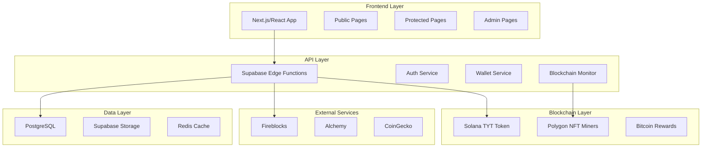
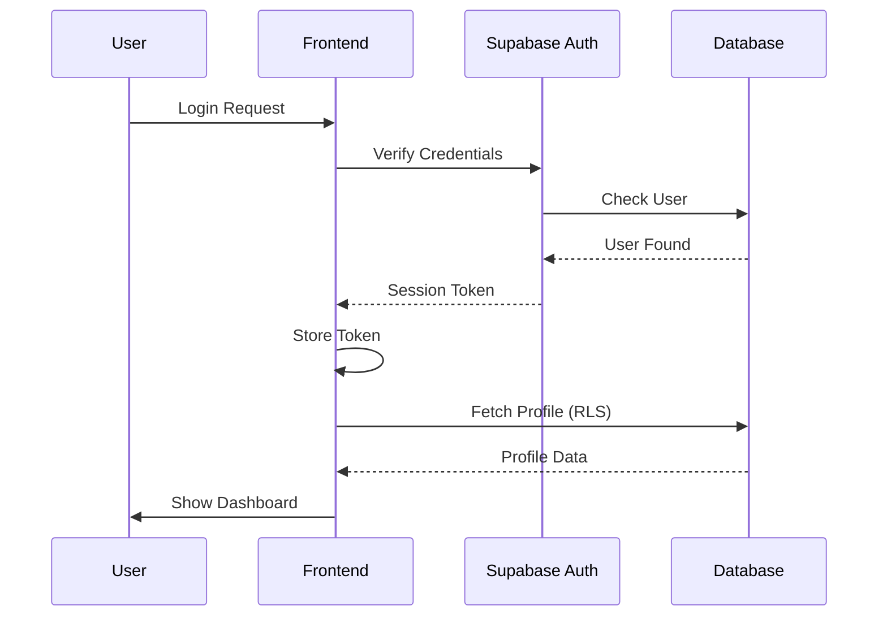
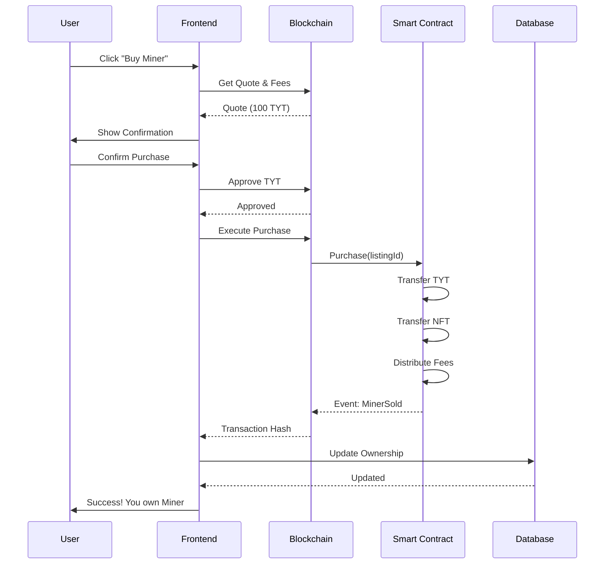

# 🏃 Sprint 1: Architecture & Security - Quick Start

**Week 1-2 | Getting Started**

**Goal**: Formalize threat model, architecture, and RBAC system
**Duration**: 2 weeks
**Status**: Ready to begin

---

## 📋 Sprint Overview

```
Sprint 1 Checklist:
□ Day 1-3:   Create threat model document
□ Day 4-5:   Design system architecture
□ Day 6-8:   Implement RBAC system
□ Day 9-10:  Set up key management
□ Day 11-14: Configure monitoring & alerts
```

---

## 🎯 Day 1-3: Threat Model

### Task 1.1: Identify Critical Assets

**File to create**: `/docs/THREAT_MODEL.md`

**Critical Assets to Document**:
```yaml
Financial Assets:
  - User custodial wallets (BTC, TYT, USDT)
  - Platform treasury wallet
  - Rewards distribution wallet
  - Foundation donation wallet

Security Assets:
  - Private keys (smart contract owners)
  - HSM/Fireblocks master keys
  - Admin credentials
  - API keys (Alchemy, CoinGecko, etc)

User Data:
  - KYC documents (passport, ID, address proof)
  - Personal information (name, email, phone)
  - Financial history (transactions, balances)
  - Session tokens

Business Logic:
  - Smart contract ownership
  - Database access (Supabase service role key)
  - Edge function secrets
  - Email service credentials
```

### Task 1.2: Map Attack Vectors

**For Each Asset, Document**:
```markdown
## Attack Vector: Smart Contract Reentrancy

**Target**: MinerNFT, Marketplace contracts
**Impact**: CRITICAL - Loss of all platform funds
**Likelihood**: MEDIUM - Known vulnerability pattern

**Attack Scenario**:
1. Attacker deploys malicious contract
2. Malicious contract purchases miner
3. During transfer, calls back to marketplace
4. Re-enters purchase function before state update
5. Drains marketplace funds

**Mitigation**:
- [x] Use Checks-Effects-Interactions pattern
- [x] Add ReentrancyGuard from OpenZeppelin
- [x] Comprehensive testing
- [ ] External audit
- [ ] Bug bounty program

**Detection**:
- Monitor for unusual contract interactions
- Alert on multiple purchases in single block
- Real-time balance monitoring

**Response**:
- Pause contracts immediately
- Investigate transaction
- Coordinate with auditors
- Public disclosure after fix
```

**Repeat for all vectors** (see full list in master roadmap)

### Task 1.3: Create Threat Matrix

**Spreadsheet/Table**:
```
| Threat | Asset | Impact | Likelihood | Risk Score | Status |
|--------|-------|--------|------------|------------|--------|
| Reentrancy | Smart Contracts | Critical | Medium | 8/10 | Mitigated |
| XSS | User Data | High | High | 9/10 | Mitigated |
| Key Theft | Private Keys | Critical | Low | 6/10 | Mitigated |
| ... | ... | ... | ... | ... | ... |
```

**Risk Score Calculation**:
```
Risk Score = (Impact × Likelihood) / 10
- Critical Impact = 10
- High Impact = 7
- Medium Impact = 4
- Low Impact = 1

- High Likelihood = 10
- Medium Likelihood = 5
- Low Likelihood = 2
```

**Tools**:
```bash
# Use threat modeling tool (optional)
npm install -g threat-dragon
threat-dragon
```

**Deliverable Day 1-3**: Complete threat model document with:
- All critical assets identified
- All attack vectors documented
- Mitigation strategies defined
- Risk matrix created

---

## 🏗️ Day 4-5: System Architecture

### Task 2.1: Create Architecture Diagrams

**File to create**: `/docs/SYSTEM_ARCHITECTURE.md`

**Diagram 1: High-Level System**

Use Mermaid or draw.io:



**Diagram 2: Authentication Flow**



**Diagram 3: Marketplace Purchase Flow**



### Task 2.2: Document Data Flow

**For Each Feature**:
```markdown
## Feature: Daily Rewards Distribution

**Trigger**: Cron job (daily at 00:00 UTC)

**Data Flow**:
1. Edge Function: `cron-daily-rewards` triggered
2. Query: Fetch all active miners from database
3. For each miner:
   a. Calculate gross BTC reward (hashrate × network difficulty)
   b. Subtract electricity cost (region-based)
   c. Subtract service fee (10%)
   d. Distribute fee (60% protocol, 30% charity, 10% academy)
   e. Calculate net reward
4. Generate Merkle tree of all rewards
5. Store Merkle root on-chain (gas optimization)
6. Save individual rewards to database
7. Send notifications to users
8. Update dashboard metrics

**Performance**:
- Expected: 1000 miners in 30 seconds
- Database queries: 1 (batch fetch)
- Blockchain transactions: 1 (Merkle root)
- Notifications: Queued for batch sending

**Error Handling**:
- If blockchain fails: Retry 3 times, then alert admin
- If calculation fails: Skip miner, log error, continue
- If database fails: Rollback, alert admin, retry after 5 min

**Monitoring**:
- Alert if takes >1 minute
- Alert if any errors
- Daily report with total distributed
```

### Task 2.3: Define Service Boundaries

**Microservices** (via Edge Functions):
```typescript
// Auth Service
- register(email, password)
- login(email, password)
- logout()
- refreshToken()
- updatePassword()

// Wallet Service
- getBalance(userId, asset)
- generateDepositAddress(userId, asset)
- requestWithdrawal(userId, asset, amount, address)
- processDeposit(txHash)
- processWithdrawal(requestId)

// Miner Service
- mintMiner(params)
- transferMiner(minerId, toAddress)
- upgradeMiner(minerId, upgradeType)
- listMiner(minerId, price)
- purchaseMiner(listingId)

// Rewards Service
- calculateRewards()
- generateMerkleTree()
- claimRewards(userId, proof)
- getRewardHistory(userId)

// Governance Service
- createProposal(params)
- vote(proposalId, choice)
- executeProposal(proposalId)
- getVotingPower(userId)
```

**Deliverable Day 4-5**: Complete architecture document with:
- All system diagrams
- All data flows documented
- Service boundaries defined
- Performance targets set

---

## 🔐 Day 6-8: RBAC Implementation

### Task 3.1: Define Roles & Permissions

**File to create**: `/src/types/rbac.ts`

```typescript
/**
 * User roles in the TYT Platform
 */
export enum UserRole {
  GUEST = 'guest',
  USER = 'user',
  PREMIUM = 'premium',
  VIP = 'vip',
  MENTOR = 'mentor',
  FOUNDATION_EDITOR = 'foundation_editor',
  MODERATOR = 'moderator',
  ADMIN = 'admin',
  SUPER_ADMIN = 'super_admin'
}

/**
 * Granular permissions
 */
export enum Permission {
  // Mining
  VIEW_MINERS = 'view_miners',
  BUY_MINERS = 'buy_miners',
  SELL_MINERS = 'sell_miners',
  UPGRADE_MINERS = 'upgrade_miners',

  // Marketplace
  LIST_MARKETPLACE = 'list_marketplace',
  PURCHASE_MARKETPLACE = 'purchase_marketplace',
  CANCEL_LISTING = 'cancel_listing',

  // Wallet
  VIEW_BALANCE = 'view_balance',
  DEPOSIT = 'deposit',
  WITHDRAW = 'withdraw',
  INTERNAL_TRANSFER = 'internal_transfer',

  // Academy
  VIEW_LESSONS = 'view_lessons',
  COMPLETE_LESSONS = 'complete_lessons',
  COMPLETE_QUESTS = 'complete_quests',
  CREATE_LESSONS = 'create_lessons',
  EDIT_LESSONS = 'edit_lessons',
  ISSUE_CERTIFICATES = 'issue_certificates',

  // Foundation
  VIEW_FOUNDATION = 'view_foundation',
  DONATE = 'donate',
  APPLY_GRANT = 'apply_grant',
  CREATE_FOUNDATION_CONTENT = 'create_foundation_content',
  EDIT_FOUNDATION_CONTENT = 'edit_foundation_content',
  MANAGE_GRANTS = 'manage_grants',

  // Governance
  VIEW_PROPOSALS = 'view_proposals',
  CREATE_PROPOSALS = 'create_proposals',
  VOTE = 'vote',
  EXECUTE_PROPOSALS = 'execute_proposals',

  // Community
  VIEW_LEADERBOARD = 'view_leaderboard',
  JOIN_CLANS = 'join_clans',
  CREATE_CLANS = 'create_clans',
  MANAGE_CLANS = 'manage_clans',

  // Admin
  VIEW_USERS = 'view_users',
  MANAGE_USERS = 'manage_users',
  APPROVE_KYC = 'approve_kyc',
  APPROVE_WITHDRAWALS = 'approve_withdrawals',
  MANAGE_CONTRACTS = 'manage_contracts',
  VIEW_ANALYTICS = 'view_analytics',
  SYSTEM_SETTINGS = 'system_settings'
}

/**
 * Role-Permission mapping
 */
export const ROLE_PERMISSIONS: Record<UserRole, Permission[]> = {
  [UserRole.GUEST]: [
    Permission.VIEW_LESSONS,
    Permission.VIEW_FOUNDATION,
    Permission.VIEW_LEADERBOARD,
    Permission.VIEW_PROPOSALS
  ],

  [UserRole.USER]: [
    ...ROLE_PERMISSIONS[UserRole.GUEST],
    Permission.VIEW_MINERS,
    Permission.VIEW_BALANCE,
    Permission.COMPLETE_LESSONS,
    Permission.COMPLETE_QUESTS,
    Permission.DONATE,
    Permission.DEPOSIT,
    Permission.JOIN_CLANS
  ],

  [UserRole.PREMIUM]: [
    ...ROLE_PERMISSIONS[UserRole.USER],
    Permission.BUY_MINERS,
    Permission.LIST_MARKETPLACE,
    Permission.PURCHASE_MARKETPLACE,
    Permission.WITHDRAW,
    Permission.VOTE,
    Permission.CREATE_CLANS
  ],

  [UserRole.VIP]: [
    ...ROLE_PERMISSIONS[UserRole.PREMIUM],
    Permission.SELL_MINERS,
    Permission.UPGRADE_MINERS,
    Permission.INTERNAL_TRANSFER,
    Permission.CREATE_PROPOSALS
  ],

  [UserRole.MENTOR]: [
    ...ROLE_PERMISSIONS[UserRole.USER],
    Permission.CREATE_LESSONS,
    Permission.EDIT_LESSONS,
    Permission.ISSUE_CERTIFICATES
  ],

  [UserRole.FOUNDATION_EDITOR]: [
    ...ROLE_PERMISSIONS[UserRole.USER],
    Permission.CREATE_FOUNDATION_CONTENT,
    Permission.EDIT_FOUNDATION_CONTENT,
    Permission.MANAGE_GRANTS
  ],

  [UserRole.MODERATOR]: [
    ...ROLE_PERMISSIONS[UserRole.USER],
    Permission.VIEW_USERS,
    Permission.MANAGE_CLANS
  ],

  [UserRole.ADMIN]: [
    ...Object.values(Permission) // All permissions except...
  ].filter(p => p !== Permission.SYSTEM_SETTINGS),

  [UserRole.SUPER_ADMIN]: Object.values(Permission) // ALL permissions
};
```

### Task 3.2: Implement RBAC Service

**File to create**: `/src/lib/rbac.ts`

```typescript
import { UserRole, Permission, ROLE_PERMISSIONS } from '@/types/rbac';
import { supabase } from './supabase';

export class RBACService {
  /**
   * Check if user has a specific permission
   */
  static async hasPermission(
    userId: string,
    permission: Permission
  ): Promise<boolean> {
    // Get user profile with role
    const { data: profile } = await supabase
      .from('profiles')
      .select('role, is_active')
      .eq('id', userId)
      .single();

    if (!profile || !profile.is_active) {
      return false;
    }

    const role = profile.role as UserRole;
    const permissions = ROLE_PERMISSIONS[role];

    return permissions.includes(permission);
  }

  /**
   * Check if user has any of the permissions
   */
  static async hasAnyPermission(
    userId: string,
    permissions: Permission[]
  ): Promise<boolean> {
    const checks = await Promise.all(
      permissions.map(p => this.hasPermission(userId, p))
    );
    return checks.some(check => check);
  }

  /**
   * Check if user has all permissions
   */
  static async hasAllPermissions(
    userId: string,
    permissions: Permission[]
  ): Promise<boolean> {
    const checks = await Promise.all(
      permissions.map(p => this.hasPermission(userId, p))
    );
    return checks.every(check => check);
  }

  /**
   * Get all permissions for user
   */
  static async getUserPermissions(userId: string): Promise<Permission[]> {
    const { data: profile } = await supabase
      .from('profiles')
      .select('role')
      .eq('id', userId)
      .single();

    if (!profile) return [];

    const role = profile.role as UserRole;
    return ROLE_PERMISSIONS[role];
  }

  /**
   * Check if user has role
   */
  static async hasRole(userId: string, role: UserRole): Promise<boolean> {
    const { data: profile } = await supabase
      .from('profiles')
      .select('role')
      .eq('id', userId)
      .single();

    return profile?.role === role;
  }
}
```

### Task 3.3: Create React Hooks

**File to create**: `/src/hooks/usePermission.ts`

```typescript
import { useAuth } from '@/contexts/AuthContext';
import { Permission } from '@/types/rbac';
import { RBACService } from '@/lib/rbac';
import { useQuery } from '@tanstack/react-query';

export function usePermission(permission: Permission) {
  const { user } = useAuth();

  return useQuery({
    queryKey: ['permission', user?.id, permission],
    queryFn: () => RBACService.hasPermission(user!.id, permission),
    enabled: !!user,
    staleTime: 5 * 60 * 1000 // 5 minutes
  });
}

export function usePermissions() {
  const { user } = useAuth();

  return useQuery({
    queryKey: ['permissions', user?.id],
    queryFn: () => RBACService.getUserPermissions(user!.id),
    enabled: !!user,
    staleTime: 5 * 60 * 1000
  });
}

// Usage in components
function BuyMinerButton() {
  const { data: canBuy, isLoading } = usePermission(Permission.BUY_MINERS);

  if (isLoading) return <Spinner />;
  if (!canBuy) return <UpgradePrompt />;

  return <Button onClick={handleBuy}>Buy Miner</Button>;
}
```

### Task 3.4: Add Database Column

**Migration**:
```sql
-- Add role column to profiles (if not exists)
ALTER TABLE profiles
ADD COLUMN IF NOT EXISTS role text DEFAULT 'user'
  CHECK (role IN (
    'guest', 'user', 'premium', 'vip', 'mentor',
    'foundation_editor', 'moderator', 'admin', 'super_admin'
  ));

-- Index for performance
CREATE INDEX IF NOT EXISTS idx_profiles_role
  ON profiles(role);

-- Update existing users based on KYC tier
UPDATE profiles
SET role = CASE
  WHEN kyc_tier >= 3 THEN 'vip'
  WHEN kyc_tier >= 2 THEN 'premium'
  WHEN kyc_tier >= 1 THEN 'user'
  ELSE 'user'
END
WHERE role IS NULL;
```

**Deliverable Day 6-8**: Complete RBAC system with:
- All roles and permissions defined
- RBAC service implemented
- React hooks created
- Database updated
- Tests written

---

## 🔑 Day 9-10: Key Management

### Task 4.1: Choose Key Management Solution

**Options**:

**Option A: Fireblocks** (Recommended for production)
- Pros: Industry standard, MPC, insurance
- Cons: Expensive (~$10k/year)
- Use case: Mainnet

**Option B: AWS KMS** (Good for testnet)
- Pros: Cheaper, integrated with AWS
- Cons: Less crypto-specific
- Use case: Testnet/Development

**Option C: Self-hosted HSM**
- Pros: Full control
- Cons: Complex setup, security risk
- Use case: Not recommended

**Recommendation**: AWS KMS for testnet, Fireblocks for mainnet

### Task 4.2: Set Up Key Management

**For AWS KMS** (Testnet):

```bash
# 1. Install AWS CLI
brew install awscli  # macOS
# or apt-get install awscli  # Linux

# 2. Configure
aws configure

# 3. Create KMS keys
aws kms create-key \
  --description "TYT Platform - Contract Owner" \
  --key-usage SIGN_VERIFY \
  --origin AWS_KMS

# 4. Create aliases
aws kms create-alias \
  --alias-name alias/tyt-contract-owner \
  --target-key-id <key-id>
```

**Service to create**: `/src/lib/keyManagement.ts`

```typescript
import { KMSClient, SignCommand } from '@aws-sdk/client-kms';

export class KeyManagementService {
  private kms: KMSClient;

  constructor() {
    this.kms = new KMSClient({
      region: process.env.AWS_REGION,
      credentials: {
        accessKeyId: process.env.AWS_ACCESS_KEY_ID!,
        secretAccessKey: process.env.AWS_SECRET_ACCESS_KEY!
      }
    });
  }

  /**
   * Sign transaction with KMS key
   */
  async signTransaction(txData: string): Promise<string> {
    const command = new SignCommand({
      KeyId: process.env.KMS_KEY_ID,
      Message: Buffer.from(txData),
      MessageType: 'RAW',
      SigningAlgorithm: 'ECDSA_SHA_256'
    });

    const response = await this.kms.send(command);
    return Buffer.from(response.Signature!).toString('hex');
  }

  /**
   * Get public key (safe to expose)
   */
  async getPublicKey(): Promise<string> {
    // Implementation
  }
}
```

**Important**: NEVER expose private keys in frontend or logs!

### Task 4.3: Create Wallet Accounts

**Accounts Needed**:
```typescript
// Treasury accounts (KMS protected)
- treasury_main       // Platform operating funds
- treasury_rewards    // BTC rewards distribution
- treasury_foundation // Foundation donations
- treasury_academy    // Academy funds

// Hot wallets (for small amounts, automated)
- hot_deposits        // Receives user deposits
- hot_withdrawals     // Sends user withdrawals

// Cold storage (for large amounts, manual)
- cold_backup         // Long-term storage
```

**Security Policy**:
```yaml
transaction_limits:
  hot_wallet:
    max_per_tx: $1,000
    max_per_day: $10,000
    requires_approval: false

  treasury:
    max_per_tx: $100,000
    max_per_day: $500,000
    requires_approval: true
    approvers: 2  # Multi-sig

alert_thresholds:
  - amount: $5,000
    notify: admin_email
  - amount: $50,000
    notify: ceo_phone
    action: pause_withdrawals
```

**Deliverable Day 9-10**: Key management configured with:
- KMS/Fireblocks account set up
- All wallet accounts created
- Signing service implemented
- Security policies documented
- Emergency procedures defined

---

## 📊 Day 11-14: Monitoring & Alerts

### Task 5.1: Set Up Error Tracking (Sentry)

```bash
# 1. Install Sentry
npm install @sentry/react @sentry/node

# 2. Initialize (frontend)
# src/main.tsx
import * as Sentry from "@sentry/react";

Sentry.init({
  dsn: import.meta.env.VITE_SENTRY_DSN,
  environment: import.meta.env.MODE,
  tracesSampleRate: 0.1,
  integrations: [
    new Sentry.BrowserTracing(),
    new Sentry.Replay()
  ]
});

# 3. Initialize (backend)
# supabase/functions/_shared/sentry.ts
import * as Sentry from "@sentry/node";

Sentry.init({
  dsn: Deno.env.get("SENTRY_DSN"),
  environment: "production"
});
```

### Task 5.2: Set Up Metrics (Grafana + Prometheus)

**For Supabase**:
- Use built-in Supabase Dashboard metrics
- No additional setup needed

**For Custom Metrics**:
```typescript
// supabase/functions/_shared/metrics.ts
export const metrics = {
  async track(metric: string, value: number, tags: Record<string, string>) {
    await supabase.from('platform_metrics').insert({
      metric_name: metric,
      metric_value: value,
      tags,
      timestamp: new Date()
    });
  }
};

// Usage
await metrics.track('miner_purchased', 1, {
  user_id: userId,
  miner_type: 'S19 Pro'
});
```

### Task 5.3: Configure Alerts

**Alert Rules** (`/docs/ALERT_RULES.md`):
```yaml
critical_alerts:
  - name: platform_down
    condition: uptime < 99%
    window: 5 minutes
    notify: [email, sms, pagerduty]

  - name: smart_contract_paused
    condition: contract.paused = true
    window: immediate
    notify: [email, sms, discord]

  - name: large_withdrawal
    condition: withdrawal.amount > $10000
    window: immediate
    notify: [email, sms]
    action: require_manual_approval

high_priority:
  - name: high_error_rate
    condition: error_rate > 5%
    window: 10 minutes
    notify: [email, discord]

  - name: slow_response
    condition: response_time > 3s
    window: 5 minutes
    notify: [email]

medium_priority:
  - name: failed_transaction
    condition: tx_failed = true
    window: immediate
    notify: [email]
```

**Implementation**: Use Supabase Edge Function + webhook

```typescript
// supabase/functions/alert-manager/index.ts
Deno.serve(async (req: Request) => {
  const alert = await req.json();

  if (alert.severity === 'critical') {
    // Send SMS via Twilio
    await sendSMS(alert);
    // Send email
    await sendEmail(alert);
    // Post to Discord
    await postToDiscord(alert);
    // Create PagerDuty incident
    await createPagerDutyIncident(alert);
  }

  return new Response(JSON.stringify({ success: true }));
});
```

### Task 5.4: Create Dashboard

**Grafana Dashboard** (or use Supabase Dashboard):

Panels to include:
```
Row 1: System Health
- Uptime (%)
- Error rate (%)
- Response time (ms)
- Active users

Row 2: Business Metrics
- Total miners minted
- Marketplace sales (24h)
- Total TVL (USD)
- Foundation donations (USD)

Row 3: Blockchain
- Contract gas used
- Failed transactions
- Pending transactions
- Average gas price

Row 4: User Activity
- New registrations
- Active users
- Session duration
- Bounce rate
```

**Deliverable Day 11-14**: Monitoring fully configured with:
- Sentry catching all errors
- Custom metrics tracked
- Alert rules configured
- Notifications working
- Dashboard accessible

---

## ✅ Sprint 1 Definition of Done

At the end of 2 weeks, you should have:

```
Documentation:
✅ Threat model document complete
✅ System architecture diagrams created
✅ Security procedures documented
✅ Emergency response plan written

Code:
✅ RBAC system implemented and tested
✅ Key management configured
✅ Monitoring & alerting active
✅ All changes committed to git

Infrastructure:
✅ AWS KMS (or Fireblocks) account set up
✅ Sentry project created
✅ Monitoring dashboards accessible
✅ Alert channels configured

Team:
✅ All team members trained on RBAC
✅ Emergency contacts established
✅ On-call rotation scheduled
✅ Security awareness training completed
```

---

## 🎯 Ready to Start?

### Recommended Approach

**Week 1 Focus**: Documentation
- Day 1-3: Threat model
- Day 4-5: Architecture

**Week 2 Focus**: Implementation
- Day 6-8: RBAC
- Day 9-10: Key management
- Day 11-14: Monitoring

### Team Allocation

**Solo Developer**: Follow the schedule as-is
**Small Team (2-3)**: Parallelize tasks
- Dev 1: Threat model + Architecture
- Dev 2: RBAC implementation
- Dev 3: Monitoring setup

**Larger Team (4+)**: One task per person

---

## 📞 Need Help?

**Resources**:
- OWASP Threat Modeling: https://owasp.org/www-community/Threat_Modeling
- AWS KMS Guide: https://docs.aws.amazon.com/kms/
- Sentry Docs: https://docs.sentry.io/
- System Design Primer: https://github.com/donnemartin/system-design-primer

**Questions?**
- Check `/docs/` for existing documentation
- Review `/TYT_V3_TESTNET_MASTER_ROADMAP.md` for context
- Create GitHub issue for blockers

---

**Let's build secure foundations! 🛡️**

**Next**: After Sprint 1, proceed to Sprint 2 (Blockchain Infrastructure)
