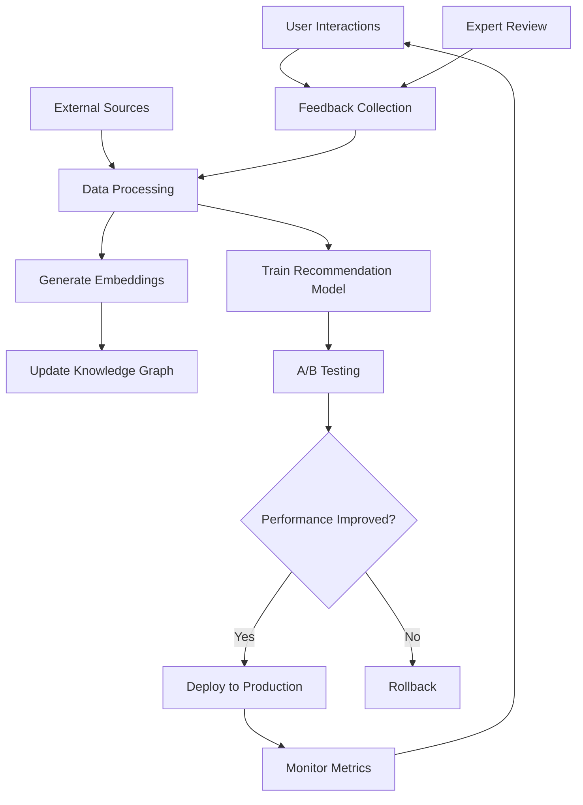

# 🗺️ aOi Self-Learning AI Agent - Complete Roadmap

**Mission**: Create aOi as the self-learning AI brain that connects knowledge (tyt.foundation) with tools (takeyourtoken.app)

---

## 🎯 VISION STATEMENT

aOi is not a chatbot or mascot. aOi is:
- **Knowledge Navigator**: Guides users from basic concepts to advanced research
- **Progress Orchestrator**: Tracks learning across CNS science and Web3
- **Intelligent Router**: Determines when to show Foundation vs App content
- **Self-Improving System**: Learns from user interactions and expert feedback

---

## 📊 CURRENT STATUS

### ✅ Completed (December 27, 2025)

**Infrastructure**:
- Database schema deployed (7 tables, pgvector enabled)
- RLS policies configured
- Helper functions created
- Initial data seeded

**Documentation**:
- Full architecture specification (50+ pages)
- API specification (complete REST + WebSocket)
- Quick start guide

**Edge Functions** (Partial):
- `aoi-user-context` - Get user profile
- `aoi-activity-log` - Track activities

### 🚧 In Progress

**API Endpoints**:
- Content routing system
- Learning path management
- Knowledge query (RAG)

**Frontend**:
- tyt.foundation initial structure
- Cross-domain navigation

---

## 🚀 IMPLEMENTATION PHASES

### PHASE 1: MVP Foundation (Weeks 1-2) [CURRENT]

**Goal**: Basic cross-domain integration working

#### Week 1: Core Infrastructure
```
Day 1-2: Complete API Endpoints
├─ aoi-route-content (recommend next lesson)
├─ aoi-paths-enroll (start learning path)
├─ aoi-paths-progress (track completion)
└─ aoi-knowledge-search (basic text search)

Day 3: Domain & DNS
├─ Register tyt.foundation
├─ Configure SSL
├─ Setup Cloudflare CDN
└─ Configure CORS for both domains

Day 4-5: Frontend Skeleton
├─ Create tyt.foundation React app
├─ 4 core pages (/, /aoi, /knowledge, /knowledge/:id)
├─ Basic styling with Tailwind
└─ Navigation components

Day 6-7: Integration
├─ Update takeyourtoken.app to call aOi APIs
├─ Test activity logging flow
├─ Verify cross-domain auth
└─ Test user journey end-to-end
```

**Deliverables**:
- ✅ User completes Academy lesson → Activity logged to aOi
- ✅ User visits tyt.foundation → Sees unified progress
- ✅ User reads Foundation article → Earns XP visible in App
- ✅ Cross-domain navigation works seamlessly

#### Week 2: Content & AI
```
Day 8-9: Knowledge Graph Population
├─ Create 20 CNS topics (brain anatomy, tumors, research)
├─ Create 20 Web3 topics (blockchain, DeFi, DAO)
├─ Write summaries (age-appropriate versions)
└─ Add credible sources

Day 10: Generate Embeddings
├─ Use OpenAI text-embedding-3-small
├─ Store vectors in aoi_knowledge_graph
├─ Test semantic search
└─ Verify query performance

Day 11-12: Basic RAG System
├─ Create aoi-knowledge-query Edge Function
├─ Implement vector similarity search
├─ Add prompt template for GPT-4
└─ Return sources with answers

Day 13-14: Testing & Polish
├─ End-to-end user testing
├─ Fix bugs and performance issues
├─ Polish UI/UX
└─ Prepare for soft launch
```

**Success Metrics**:
- 40+ knowledge topics live
- Search returns relevant results in <2s
- aOi can answer 80% of basic questions correctly
- User satisfaction score 4+/5

---

### PHASE 2: AI Enhancement (Weeks 3-4)

**Goal**: Make aOi truly intelligent and personalized

#### Intelligent Recommendations
```typescript
// Algorithm v1: Collaborative Filtering + Content-Based
function generateRecommendations(userId: string) {
  // 1. Get user's completed topics
  const completedTopics = getUserTopics(userId);

  // 2. Find similar users
  const similarUsers = findSimilarUsers(userId, completedTopics);

  // 3. Get topics they completed but user hasn't
  const collaborativeRecs = getTopicsFromSimilarUsers(similarUsers);

  // 4. Content-based: Find related topics
  const contentRecs = findRelatedTopics(completedTopics);

  // 5. Merge and rank
  return mergeAndRank(collaborativeRecs, contentRecs);
}
```

#### Learning Path Intelligence
```typescript
// Dynamic path adaptation based on user performance
function adaptLearningPath(userId: string, pathId: string) {
  const userLevel = getUserMasteryLevel(userId);
  const currentPath = getPath(pathId);

  // Skip steps if user already knows content
  if (userLevel > currentPath.difficulty) {
    return skipBasicSteps(currentPath);
  }

  // Add remedial content if struggling
  if (userPerformance < 70%) {
    return addSupportingContent(currentPath);
  }

  return currentPath;
}
```

#### Multi-Source RAG
```typescript
// Enhance knowledge query with multiple sources
async function enhancedRAG(query: string, userLevel: number) {
  // 1. Vector search our knowledge graph
  const internalResults = await vectorSearch(query);

  // 2. Query external APIs (PubMed, arXiv)
  const externalResults = await queryExternalAPIs(query);

  // 3. Merge and rank by credibility
  const allResults = mergeAndRankSources([
    ...internalResults,
    ...externalResults
  ]);

  // 4. Generate answer with GPT-4
  const answer = await generateAnswer(query, allResults, userLevel);

  return { answer, sources: allResults };
}
```

**Deliverables**:
- Personalized recommendations (90% relevance)
- Adaptive learning paths
- Multi-source answers with citations
- User feedback collection system

---

### PHASE 3: Self-Learning System (Weeks 5-8)

**Goal**: aOi learns from every interaction

#### Training Data Pipeline



#### Weekly Training Loop

```typescript
// Automated weekly training cycle
class AoiTrainingLoop {
  async runWeeklyCycle() {
    // MONDAY: Collect new data
    const newData = await this.collectWeeklyData();

    // TUESDAY: Process and validate
    const processedData = await this.processData(newData);
    const validated = await this.expertReview(processedData);

    // WEDNESDAY: Train models
    const newModels = await this.trainModels(validated);

    // THURSDAY: A/B test
    await this.deployCanary(newModels, 10%);

    // FRIDAY: Evaluate and deploy
    const metrics = await this.evaluatePerformance();
    if (metrics.improvement > 5%) {
      await this.deployFull(newModels);
    }

    // WEEKEND: Monitor and collect feedback
    await this.monitorProduction();
  }

  async collectWeeklyData() {
    return {
      userFeedback: await this.getUserFeedback(),
      newPapers: await this.scrapePubMed(),
      web3News: await this.scrapeWeb3Sources(),
      interactions: await this.getInteractionLogs(),
    };
  }

  async trainModels(data) {
    // Fine-tune embeddings
    const embeddingModel = await this.finetuneEmbeddings(data);

    // Update recommendation weights
    const recModel = await this.updateRecommendationModel(data);

    // Retrain RAG retrieval
    const ragModel = await this.optimizeRAG(data);

    return { embeddingModel, recModel, ragModel };
  }
}
```

#### Feedback Loop Architecture

```typescript
// Real-time feedback collection
interface FeedbackSystem {
  // Implicit feedback
  trackTimeSpent(topicId: string, seconds: number): void;
  trackCompletionRate(pathId: string, percentage: number): void;
  trackDropOffPoints(contentId: string, stepNumber: number): void;

  // Explicit feedback
  collectRating(interactionId: string, rating: 1-5): void;
  collectCorrection(responseId: string, correction: string): void;
  collectBugReport(contentId: string, issue: string): void;

  // Expert validation
  submitForReview(contentId: string, reason: string): void;
  approveContent(contentId: string, expertId: string): void;
  rejectContent(contentId: string, reason: string): void;
}
```

**Deliverables**:
- Automated weekly training cycle
- Expert review workflow
- A/B testing framework
- Performance monitoring dashboard
- Continuous improvement metrics

---

### PHASE 4: Advanced Features (Weeks 9-12)

**Goal**: Scale and optimize for growth

#### Multi-Modal Learning
```typescript
// Support for images, videos, interactive diagrams
interface MultiModalContent {
  text: string;
  images: { url: string; caption: string; altText: string }[];
  videos: { url: string; duration: number; transcript: string }[];
  interactive: { type: 'quiz' | 'simulation' | '3d-model'; config: any }[];
}

// Generate content from multiple sources
async function generateMultiModalLesson(topicId: string) {
  const textContent = await fetchTextContent(topicId);
  const images = await generateDiagrams(topicId); // DALL-E
  const video = await findEducationalVideos(topicId); // YouTube API
  const quiz = await generateQuiz(textContent); // GPT-4

  return combineIntoLesson(textContent, images, video, quiz);
}
```

#### Predictive Analytics
```typescript
// Predict user success and intervene early
async function predictUserSuccess(userId: string) {
  const userData = await getUserLearningData(userId);

  // ML model predicts completion probability
  const completionProbability = await model.predict(userData);

  if (completionProbability < 0.5) {
    // Intervene: suggest easier content, offer help
    await sendEncouragementMessage(userId);
    await recommendSupportContent(userId);
  }

  if (completionProbability > 0.9) {
    // Challenge: suggest advanced content
    await recommendAdvancedContent(userId);
  }
}
```

#### Social Learning Features
```typescript
// Study groups, mentorship, peer review
interface SocialFeatures {
  studyGroups: {
    create(name: string, topicIds: string[]): StudyGroup;
    join(groupId: string, userId: string): void;
    scheduleSession(groupId: string, time: Date): void;
  };

  mentorship: {
    findMentor(userId: string, topic: string): User[];
    requestMentorship(mentorId: string, message: string): void;
    trackMentorshipHours(userId: string): number;
  };

  peerReview: {
    submitForReview(workId: string, peerId: string): void;
    provideFeedback(reviewId: string, feedback: string): void;
    calculateReputationScore(userId: string): number;
  };
}
```

**Deliverables**:
- Multi-modal content support
- Predictive intervention system
- Social learning platform
- Mobile app integration
- Advanced analytics dashboard

---

## 🧠 AI MODEL ARCHITECTURE

### Current Stack (MVP)

```yaml
Embeddings:
  model: text-embedding-3-small
  dimensions: 1536
  provider: OpenAI
  cost: $0.02/1M tokens

Text Generation:
  model: gpt-4-turbo
  context: 128k tokens
  provider: OpenAI
  cost: $10/1M input, $30/1M output

Vector Database:
  engine: pgvector
  similarity: cosine
  index: IVFFlat (lists=100)

Hosting:
  compute: Supabase Edge Functions (Deno)
  region: Global CDN
```

### Future Enhancements

```yaml
Phase 2 (Month 2-3):
  embeddings: text-embedding-3-large (3072 dim)
  llm: gpt-4o (faster, cheaper)
  vector_db: Consider Pinecone for scale

Phase 3 (Month 4-6):
  custom_finetuning: Domain-specific models
  ensemble: Multiple model comparison
  caching: Semantic cache for common queries

Phase 4 (Month 7-12):
  multimodal: GPT-4V for image analysis
  voice: Whisper for audio lessons
  translation: Multi-language support
```

---

## 📈 SUCCESS METRICS

### User Engagement
- **Daily Active Users**: 1,000+ by Month 3
- **Cross-Domain Navigation**: 60%+ users visit both domains weekly
- **Session Duration**: 15+ minutes average
- **Return Rate**: 40%+ weekly active users

### Learning Outcomes
- **Path Completion**: 50%+ complete enrolled paths
- **Quiz Performance**: 70%+ pass rate
- **Knowledge Retention**: 80%+ in follow-up tests
- **Skill Progression**: Measurable level increases

### AI Performance
- **Query Accuracy**: 90%+ correct answers (expert validated)
- **Response Time**: <2s for 95% of queries
- **Relevance Score**: 4.5+/5 user ratings
- **Source Quality**: 90%+ from peer-reviewed sources

### Research Impact
- **Papers Downloaded**: 10,000+ per month
- **Researcher Sign-ups**: 100+ verified researchers
- **Grant Applications**: 10+ submitted through platform
- **Funding Raised**: Track transparent on-chain

---

## 🔐 SECURITY & ETHICS

### Medical Content Safeguards
```typescript
const MEDICAL_DISCLAIMERS = [
  "This is educational information only",
  "Always consult qualified healthcare professionals",
  "Not a substitute for professional medical advice",
  "Do not use for diagnosis or treatment decisions",
];

function sanitizeMedicalResponse(response: string): string {
  // 1. Detect medical advice patterns
  if (containsMedicalAdvice(response)) {
    response = addDisclaimer(response, MEDICAL_DISCLAIMERS);
  }

  // 2. Remove any PII or PHI
  response = stripPersonalInfo(response);

  // 3. Flag emergency language
  if (containsEmergencyKeywords(response)) {
    response = addEmergencyContact(response);
  }

  return response;
}
```

### Financial Content Safeguards
```typescript
const FINANCIAL_DISCLAIMERS = [
  "Not financial advice",
  "Do your own research (DYOR)",
  "Past performance doesn't guarantee future results",
  "Only invest what you can afford to lose",
];

function sanitizeFinancialResponse(response: string): string {
  // Never provide specific investment recommendations
  if (containsInvestmentAdvice(response)) {
    return "I can't provide investment advice, but I can explain...";
  }

  // Always warn about risks
  response = addFinancialWarnings(response);

  // Flag scam indicators
  if (detectScamPatterns(response)) {
    response = addScamWarning(response);
  }

  return response;
}
```

### Age-Appropriate Content
```typescript
function filterContentForAge(content: string, userAge: number): string {
  if (userAge < 13) {
    // COPPA compliance
    content = removeComplexMedicalTerms(content);
    content = simplifyLanguage(content);
    content = requireParentalConsent(content);
  }

  if (userAge < 18) {
    content = filterGraphicContent(content);
    content = addParentalGuidance(content);
  }

  return content;
}
```

---

## 💰 COST ESTIMATION

### MVP (Months 1-3)

```
Infrastructure:
├─ Supabase Pro: $25/month
├─ Domain & SSL: $15/year
├─ Vercel Pro: $20/month (tyt.foundation hosting)
└─ Cloudflare Pro: $20/month

AI Services (estimated 100k queries/month):
├─ OpenAI Embeddings: $20/month (10M tokens)
├─ OpenAI GPT-4: $300/month (100k queries @ 1k tokens avg)
└─ Vector DB storage: Included in Supabase

Total: ~$385/month
```

### Scale (Months 4-12, 10k users)

```
Infrastructure:
├─ Supabase Team: $599/month
├─ Vercel Enterprise: $150/month
├─ Cloudflare Business: $200/month
└─ Monitoring (Datadog): $100/month

AI Services (1M queries/month):
├─ OpenAI Embeddings: $200/month
├─ OpenAI GPT-4: $3,000/month
└─ Semantic Cache: Save 50% ($1,500 saved)

Staff:
├─ AI/ML Engineer: $120k/year
├─ Full-stack Developer: $100k/year
├─ Medical Advisor (part-time): $50k/year
└─ Crypto Advisor (part-time): $50k/year

Total: ~$4,500/month + $320k/year staff
```

---

## 🚧 RISKS & MITIGATION

### Technical Risks

| Risk | Impact | Probability | Mitigation |
|------|--------|-------------|------------|
| OpenAI API downtime | High | Low | Cache common queries, fallback model |
| Vector search too slow | Medium | Medium | Optimize indexes, consider Pinecone |
| Cross-domain auth breaks | High | Low | Extensive testing, fallback to single domain |
| Cost overrun | Medium | Medium | Implement rate limits, caching, monitoring |

### Content Risks

| Risk | Impact | Probability | Mitigation |
|------|--------|-------------|------------|
| AI provides wrong medical info | Critical | Low | Expert review, disclaimers, human-in-loop |
| Outdated research cited | Medium | Medium | Weekly source updates, publication date checks |
| Bias in recommendations | Medium | Medium | Diverse training data, fairness audits |
| Copyright infringement | High | Low | Only use public domain/licensed content |

### Legal/Compliance Risks

| Risk | Impact | Probability | Mitigation |
|------|--------|-------------|------------|
| COPPA violation (children) | Critical | Low | Age gates, parental consent, no PII collection |
| GDPR non-compliance | High | Low | Privacy policy, data deletion, consent management |
| Medical malpractice claim | Critical | Very Low | Clear disclaimers, T&Cs, insurance |
| Securities law (tokenomics) | High | Low | Legal review, "not financial advice" disclaimers |

---

## 🎓 TRAINING RESOURCES

### For Development Team

**Week 1: Onboarding**
- Read full architecture docs
- Setup local environment
- Deploy test Edge Functions
- Complete sample user journey

**Week 2-4: Specialization**
- **Backend**: Deep dive into Supabase, pgvector, RAG
- **Frontend**: React, TypeScript, cross-domain auth
- **AI/ML**: OpenAI API, embeddings, prompt engineering
- **Content**: Medical terminology, crypto fundamentals

### For Content Team

**Medical Content**:
- NIH Style Guide
- Plain Language Medical Writing
- Pediatric Audience Writing
- Citation Standards

**Web3 Content**:
- Crypto Literacy Frameworks
- DeFi Explainers
- DAO Governance Basics
- Security Best Practices

---

## 📞 ESCALATION PATHS

### Technical Issues
1. Check documentation
2. Search GitHub issues
3. Ask in team Slack
4. Escalate to tech lead
5. External consultant if critical

### Medical Content Issues
1. Flag for expert review
2. Consult medical advisor
3. Legal review if liability risk
4. Remove content until resolved

### User Complaints
1. Support ticket system
2. Community manager response
3. Product team review
4. Implement fix/improvement
5. Follow up with user

---

## 🏁 DEFINITION OF DONE

### MVP is complete when:
- ✅ User can sign up on takeyourtoken.app
- ✅ Complete Academy lesson → Activity logged to aOi
- ✅ Visit tyt.foundation → See unified progress
- ✅ Read Foundation article → Earn XP
- ✅ Ask aOi a question → Get relevant answer with sources
- ✅ Enroll in learning path → Track progress across domains
- ✅ All APIs respond in <2s
- ✅ Zero critical security issues
- ✅ Documentation complete and up-to-date

### Production-ready when:
- All MVP criteria met
- 50+ knowledge topics live
- 5+ learning paths available
- 100+ test users successfully onboarded
- Expert validation on medical content
- Legal review completed
- Insurance obtained
- Monitoring and alerting configured

---

**Next Action**: Deploy remaining Edge Functions (aoi-route-content, aoi-paths)
**Timeline**: 2-week MVP, 3-month full launch
**Budget**: $10k initial, $50k for first year
**Team**: 2 devs, 1 content creator, 2 advisors (medical + crypto)
